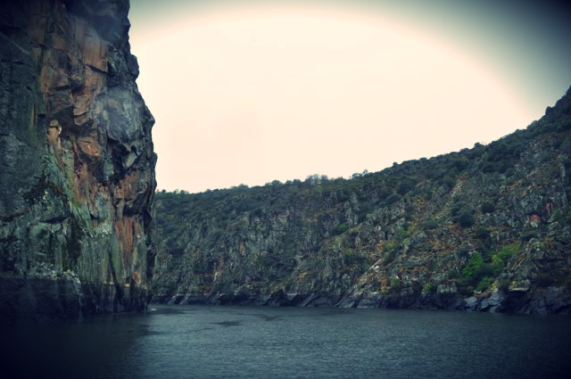

Há umas semanas tive uns dias de férias e fomos até Miranda do Douro, com paragem a meio do caminho para visitar uns tios que vivem na Beira-Baixa. Decidi dar rédea solta e não segui qualquer tipo de orientação alimentar: comi de tudo o que me apareceu à frente.  
  
Começando na casa dos meus tios que produzem quase tudo de forma muito natural: fruta e vegetais sem químicos, porcos, galinhas, coelhos e cabras que são alimentados com aquilo que a horta produz, queijo artesanal feito com leite das mesmas cabras, pão feito em forno de lenha, mel, vinho caseiro, etc. Um autentico paraíso de sabores.  
  
Miranda do Douro e arredores, muito bom. Paisagem, comida maravilhosa, pessoas simpáticas, tranquilidade. A viagem por Barca d'Alva, Freixo de Espada à Cinta, etc. sempre junto ao Douro vale bem a pena (apesar de demorar muito tempo).  
  
Para a despedida, nova paragem na Beira Baixa.  
  
Conclusão, uma semana bem passada (apesar da chuva e da Inês ter estado doente). Recomendo Miranda do Douro e arredores. Em relação à alimentação, cheguei a casa com mais 6 kg, os intestinos descontrolados (o pão desgraça tudo...), a necessitar gravemente de 24 de jejum e de voltar a uma alimentação decente. Incrivelmente, uma semana depois, já tinha voltado ao peso anterior e recuperado o bem estar geral.  
  
  

O queijo da Celeste, a minha perdição

  
  

A posta

  

Carne tenra e suculenta

  
  

A alheira

  

Veado

  

O banquete da despedida

  

Bôla de Miranda

  

  

  
  

  
  

  
  

