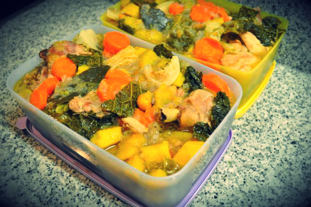

Nos últimos tempos o tempo não tem abundado cá por casa, o que faz com que tenhamos iniciado uma tentativa de cozinhar menos vezes na semana, fazendo refeições que podemos repetir no dia seguinte ou congelar para outro dia da semana. Tem corrido bem e nesta altura do ano (outono/inverno) o tipo de comida que "apetece" presta-se mais a congelação e aquecimento posterior.  
  
Temo-nos organizado da seguinte forma:  

- Fazemos um planeamento daquilo que vamos cozinhar, elaborando uma lista de compras de acordo. 
- Para não enjoar, não comemos mais do que duas vezes a mesma coisa.
- Há um dia em que o jantar é mais leve e não requer grande preparação (sopa, atum, ovos mexidos ou queijo, fruta ...).
- Só temos de cozinhar duas vezes, comemos dois dias a mesma coisa (por exemplo, segunda e quinta, jardineira, quarta e sexta, [cozido à portuguesa](http://blog.cozinhadecaverna.com/2011/11/dia-180-cozido-portuguesa-simples.html)).
- Cozinhamos tudo no sábado ou domingo à noite ou quando fazemos o almoço desse dia.
- Fazemos uma sopa e congelamos também.
- Damos preferência a comidas com molho para facilitar o aquecimento num tacho / panela.

Esta semana, vamos fazer:

- Jardineira de galinha do campo com cenoura, batata doce e lombardo (**receita mais em baixo**).
- Pernas de frango assadas no forno com couves "à moda da minha avó".

Se for possível, vou deixando mais algumas ideias no decorrer das semanas. 

  

  
Jardineira de frango com batata doce, cenoura e lombardo  
**Ingredientes (2 adultos e 1 criança comerem duas refeições)**  
Frango do campo (partido em pedaços pequenos), 1  
Moelas, 200 gr  
Cenouras, 4  
Lombardo, 1/2  
Batata doce, 2  
Cebola grande, 2  
Azeite, q.b.  
Sal, q.b.  
Pimenta, q.b.  
Pimentão doce em pó, q.b.  
Água, q.b.  
  
**Preparação**  

1. Picar as duas cebolas
2. Cobrir o fundo de uma panela grande com azeite
3. Alourar a cebola picada na panela
4. Juntar o frango, adicionando o sal, pimenta e o pimentão doce
5. Colocar uma tampa, e deixar cozinhar 20 minutos, mexendo de vez em quando
6. Cortar as cenouras às rodelas, as batatas aos cubos e as folhas de lombardo aos quadrados
7. Juntar tudo à carne, adicionando água se for necessário
8. Rectificar os temperos
9. Deixar cozinhar até a cenoura, batatas e lombardo estarem macios
10. Quando arrefecer, colocar em caixas e congelar (usar todo o molho que for possível para depois ser mais fácil aquecer)
