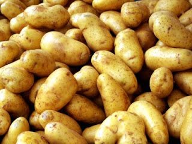

Esta semana andei a ler sobre os seguintes temas: perda de peso estagnada, _carb refeeds,_ dieta da batata e uma abordagem/explicação diferente sobre nutrição/nutrientes.  
  
Resumidamente, com uma dieta que se enquadra na _Paleo Diet_, consegui atingir e manter um peso razoável para a minha idade, estatura, etc. No entanto, e apesar de estar há 5 meses a fazer 2 a 3 treinos de Crossfit por semana, não me livro do resto da barriga.  
  
Isto levou-me a ler uns artigos sobre perda de peso estagnada e _carb refeeds_ (principalmente [este](http://www.marksdailyapple.com/17-reasons-youre-not-losing-weight/#axzz2D7r97MTF), [este](http://www.marksdailyapple.com/potatoes-healthy) e [este](http://www.marksdailyapple.com/dear-mark-should-i-increase-carb-intake-for-weight-loss/#axzz2D7r97MTF)). Entretanto, o Richard Nikoley (autor do _blog_ [Free The Animal](http://freetheanimal.com/)) anda a fazer experiências de perda dos "últimos kilos" com a dieta da batata, que consiste em comer apenas batatas durante 1 a 2 semanas. De _blog_ em _blog_, fui parar ao [Thermogenex](http://hypothermics.com/), cujo autor está a apresentar uma explicação diferente sobre nutrição, sem se focar em macronutrientes (proteínas, hidratos de carbono e lípidos), nem entrar em detalhes demasiado técnicos e detalhados para um comum mortal (como eu...). Estou a gostar. Está a fazer-me olhar de forma diferente para os alimentos, nomeadamente para os apelidados de "Hidratos" e para as quantidades de "Proteínas" que acabo por ingerir na minha dieta actual. Vou continuar a ler.  
  
Destas leituras, sobressaem algumas ideias sobre as quais ando a pensar:  

1. Só se perde gordura em défice de calorias (caso contrário o corpo nunca vai às "reservas" - de gordura).
2. O corpo necessita de duas coisas (visão simplista): glucose para "combustível" e aminoácidos, vitaminas e minerais para "manutenção".  
3. A glucose é a nossa fonte de energia básica (independentemente da sua origem, gordura, carbs ou proteínas).
4. O "combustível" pode ter origem na gordura ou nos hidratos de carbono pois ambos são convertidos para glucose. A proteína é usada depois do corpo ter retirado tudo o que necessita para "manutenção".
5. A dieta "Paleo" que tenho seguido dá-me as componentes de "manutenção" que necessito, reduz a quantidade de "combustível" ingerido, obrigando o meu corpo a ir às "reservas" (vertente low-carb).
6. Poderei estar numa fase de estagnação de perda de gordura por:

- Não estar em défice de calorias (na prática como mais fruta, carbs e gorduras do que nos primeiros meses de alteração de dieta)
- Os meus níveis de gordura reduziram, dando indicações ao corpo de falta de "energia" disponível, criando uma barreira ao acesso às reservas
- Isto pode também ser explicação para o facto de andar com mais fome (visto que o corpo sente que não há energia disponível)
- Não andar a dormir sempre 7 horas e o nível de cansaço ser algum

8. Comer só batatas durante 15 dias fornece ao corpo saciedade e ao mesmo tempo défice de calorias ([são necessárias 15 batatas médias para chegar a 2200 kcal, e 15 batatas é muita batata, cerca de 2.5 kg](http://ndb.nal.usda.gov/ndb/foods/show/3075?fg=&man=&lfacet=&count=&max=25&qlookup=potato&offset=&sort=&format=Abridged&_action_show=Apply+Changes&Qv=1&Q5742=0.5&Q5743=15)) e todos os aminoácidos essenciais, o que poderá traduzir-se em maior acesso às "reservas".
9. Comer só batatas para sempre é impossível por questões de monotonia mas também por falta de outros nutrientes que o corpo necessita. Durante 15 dias não vem mal ao mundo e mostra que a batata em si (também dá com arroz) não é um alimento mau (apesar de não ser completo).
10. Fazer a experiência de comer só batatas durante 15 dias pode levar-me a perder "reservas" (devido ao défice de calorias) mas posteriormente é necessário encontrar um equilibrio que permita que ande mais saciado  com a dose adequada de "combustível" e "manutenção", mantendo um nível energético suficiente para as minhas actividades diárias (sem engordar) e saúde geral.

  

  
  
Com isto tudo estou tentado a experimentar o protocolo ou dieta da batata, que consiste em comer apenas batatas (temperadas com muito pouca gordura e algumas especiarias) durante 1 ou 2 semanas. Se realmente tentar este protocolo, terei de variar para conseguir aguentar. Algumas variantes possíveis são (ainda que tenha que simplificar as receitas):  
  

1. _Patatas bravas_ ([ver](http://quitutesgourmet.blogspot.pt/2010/10/papas-bravas.html))
2. Esmagada de batata ([ver](http://www.gastronomias.com/receitas/rec3075.htm))
3. Salada quente de batatas ([ver](http://www.gastronomias.com/receitas/rec2825.htm))
4. Batatas a murro com azeite e tomilho ([ver](http://www.gastronomias.com/receitas/rec3552.htm))
5. Batatas cozidas com alhos ([ver](http://www.gastronomias.com/receitas/rec1542.htm))
6. Batatas coradas ([ver](http://www.gastronomias.com/receitas/rec1031.htm))
7. Batatas ao alho ([ver](http://www.gastronomias.com/receitas/rec1582.htm))
8. Batatas à estudante ([ver](http://www.gastronomias.com/receitas/rec0751.htm))
9. Batatas de molho de alho ([ver](http://www.gastronomias.com/receitas/rec3764.htm))
10. Batatas no forno ([ver](http://mundodasreceitas.blogspot.pt/2010/12/batatas-no-forno.html))
11. Batatas salteadas ([ver](http://www.vaqueiro.pt/receitas/detalhe/1451/batatas-salteadas))
12. Batatas crocantes do Jamie Oliver ([ver](http://www.jamieoliver.com/recipes/vegetarian-recipes/perfect-roast-potatoes))
13. Puré de batata ([ver](http://www.patriciabertolucci.com.br/sobrenutricao.aspx?sobre=2&codigo=187))
14. Batata doce assada no forno

  

**ATENÇÃO**: não aconselho ninguém a fazer esta experiência. Eu irei eventualmente fazê-la por minha conta e risco. Ponha sempre a sua saúde em primeiro lugar e consulte um profissional de saúde/nutrição que o ajude a atingir os seus objectivos.
