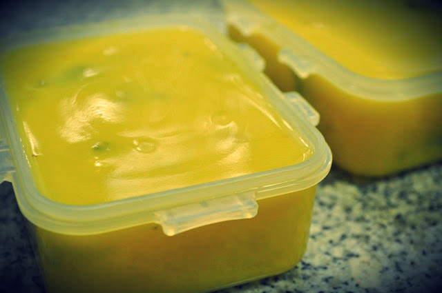

Hoje fiz um teste para ver como seria comer só batatas durante um dia inteiro.  
  
As refeições foram assim:  

- **Pequeno-almoço**: 350 gramas de batata doce assada no forno e um café
- **Almoço**: quatro batatas pequenas (duas "de cozido" e duas "a murro") e um café
- **Jantar**: sopa de batata, gengibre e coentros (receita em baixo), cerca de 400 gramas de liquido e um café.

No total foram entre 1000 e 1200 kcal ingeridas.

  

Fome? Nenhuma. Ao jantar nem me apetecia comer.

Energia? Normal.

Intestinos? Normais.

Sono? Nem por isso.

  

Vou continuar mais uns dias, amanhã vou-me pesar e [medir](http://hypothermics.com/progress/) para começar a registar progressos (ou retrocessos...).

  

  

**Sopa de batata, gengibre e coentros,** ingredientes = 500 gramas de batata, 100 gramas de batata doce, 500 gramas de água, 1/2 cebola média, 3 dentes de alho, um pedaço de gengibre, 2 c.sopa de coentros picados, 1 c.sopa de azeite, sal q.b, pimenta q.b. instruções = cozinhar todos os ingredientes, com excepção dos coentros, triturar tudo com a varinha mágica (ou usar a bimby), juntar os coentros e deixar cozinhar mais 5 ou 10 minutos.
