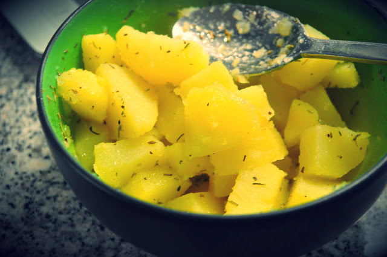
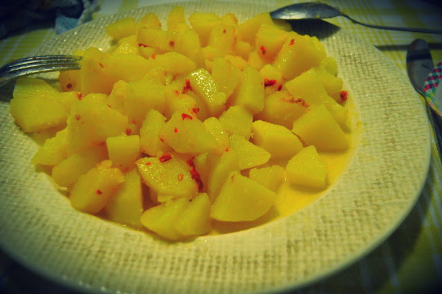

1ª dia de batatada... dificuldade acrescida para preparar pequeno-almoço a correr enquanto a Inês come, o que comer ao almoço fora de casa e o _stress_ acrescido de um dia de trabalho.  
  
De manhã fiz medições: peso = 73 Kg (menos 1 Kg que o peso anterior... não tenho explicação...).  
  
As refeições foram assim:  

- **Pequeno-almoço**: batata cozida com um pouco de azeite, vinagre e ervas Provence (250 gramas), café
- **Almoço**: batatas cozidas com um pouco de azeite, vinagre e picante (cerca de 500 gramas) e duas batatas pequenas assadas "a murro", café
- **Merenda tarde**: café
- **Jantar**: batatas cozidas com um pouco de azeite, vinagre, gengibre em pó e picante
- **Ceia**: uma bata doce pequena assada no forno

O dia correu bem no geral, não tive fome até à hora de almoço. Como não lanchei, no fim do dia quando cheguei a casa já estava com bastante fome e a quebrar (estive das 13:00 às 20:30 sem comer). Depois de jantar voltou tudo ao normal. As refeições foram um pouco monótonas mas as batatas souberam muito muito muito bem (principalmente aquelas que fiz em casa que são de melhor qualidade). Amanhã para não enjoar batata, vou fazer o dia só de arroz.

  

No total consumi:

- Água: 1135 gramas
- Energia: 1628 kcal
- Proteína: 27 gramas
- Lípidos: 41 gramas
- Hidratos de Carbono: 291 gramas

Deixo algumas fotos:

  

Pequeno-almoço

  

Jantar

