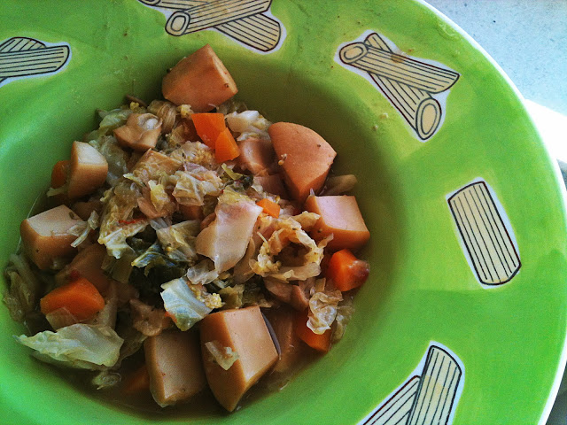
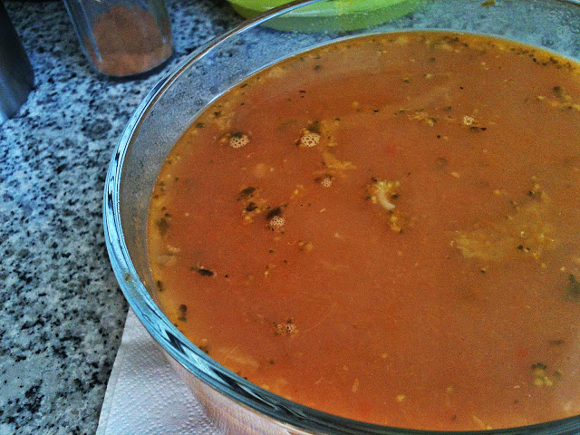

Mais uma "2 em 1", receita para para congelar e consumir durante a semana ou fazer no sábado para comer no domingo e aproveitar o fim-de-semana para outras actividades (fora da cozinha!!!). Instruções mais em baixo.

  

Ironicamente servido no "ex-prato" de massa (agora uso para comidas com caldo...)

  

O caldo, rico em nutrientes, que servirá para outra ocasião (talvez amanhã para o pequeno-almoço com um pedaço de queijo curado ou presunto...)

  

  

**Choco guisado com lombardo e cenoura**

  

Ingredientes

Choco congelado, 1kg - Lombardo grande, 1 - Brócolos, 500 gramas - Cenouras grandes, 3  - Cebolas, 2  - Alho, 4 dentes - Tomate em pedaços, 1 lata - Pimentão doce, q.b. - Sal, q.b - Azeite, q.b. - Folha de louro, 1 

  

Instruções

1. Picar a cebola e os alhos, levar a refogar com azeite numa panela de pressão. 
2. Adicionar o choco e deixar saltear um pouco. 
3. Adicionar sal, pimenta, pimentão doce, o louro e o tomate. 
4. Deixar cozinhar um pouco. 
5. Adicionar uma chávena de água quente, tapar a panela de pressão e deixar cozinhar 10 minutos com a pressão no máximo.
6. Desligar o fogão e deixar que a panela perca a pressão. 
7. Entretanto cortar os brócolos, a cenoura e o lombardo. 
8. Adicionar os vegetais ao choco.
9. Adicionar água se for necessário e rectificar os temperos.
10. Deixar cozinhar os vegetais e servir com um pouco de picante (opcional).
