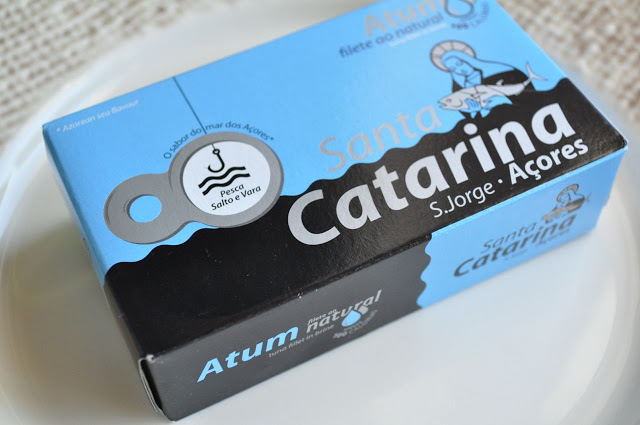
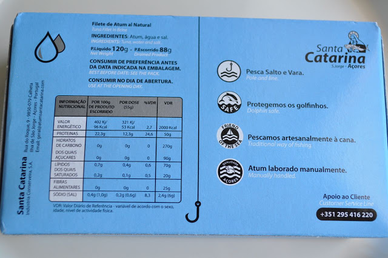
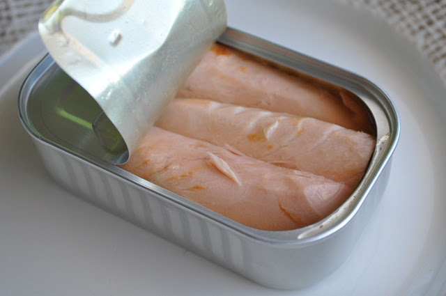
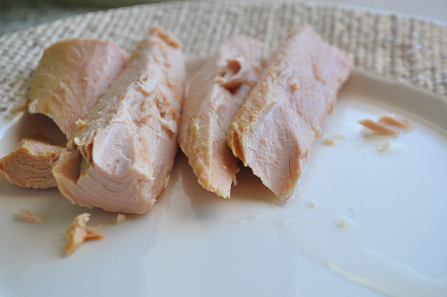
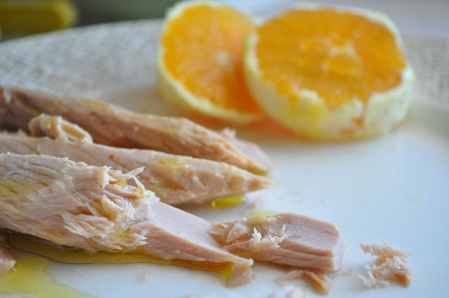

Insónias.... aproveito para fazer um _post_ que já está na calha há algum tempo. O [último](http://blog.cozinhadecaverna.com/2012/02/dia-290-saga-do-atum-prova-1-sangacho.html) sobre este tema já foi há quase um ano.  
  
Atum Santa Catarina ao Natural. Não conhecia este produto. Comprei por acaso ao ver que o Tenório tinha aumentado significativamente de preço. Já há algum tempo que tenho vindo a comer atum exclusivamente em azeite e este atum ao natural fez-me lembrar que podia escolher o tempero, sendo uma vantagem visto que a qualidade e sabor do mesmo ficam ao meu critério. De resto, este atum é de muito boa qualidade (as imagens falam por si) e tem o preço "antigo" do Tenório (o atum que consumo com mais regularidade).  
  

  

  

  

  

