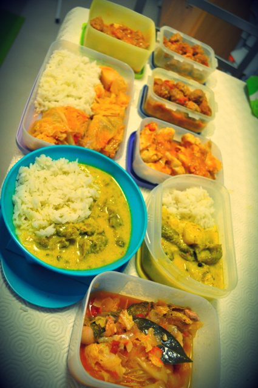
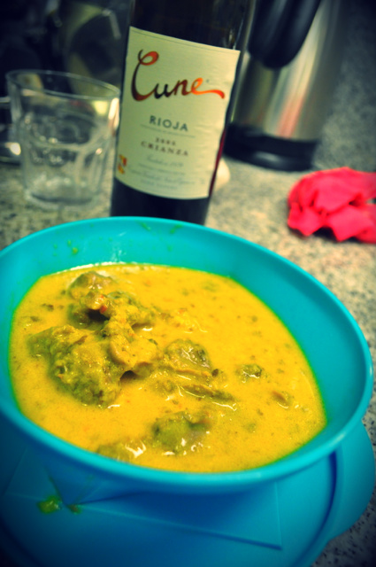
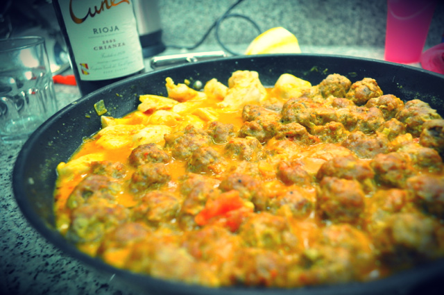

Esta semana o tempo aperta. Para facilitar os almoços e jantares, na sequência das outras receitas "2 em 1" (receitas para congelar),  fiz:

- Caril de moelas com pêra (inspirado [aqui](http://www.bbc.co.uk/food/recipes/chicken_curry_with_59058) e a [aqui](http://elvirabistrot.blogspot.pt/2010/05/moelas-guisadas.html) com mais e menos ingredientes)
- Salsichas enroladas em repolho ([receita da _bimby_](http://petiscos.com/receita.php?recid=11045&catid=33) mas feita em tacho e com algumas simplificações).
- Almôndegas em tomate (motivado por [esta](http://saborespaleo.com/recipes/79) mas baseado [nesta](http://elvirabistrot.blogspot.pt/2006/04/almndegas-com-esparguete.html))

Dei-me ao luxo de comer arroz nos dias de treino. Acompanhei todos os pratos com saladas mistas (alface, tomate, cenoura ralada, cebola e coentros).  

  

Prontas para levar e congelar

  

As moelas tenras com o caril e pêra estavam divinais

  

Almôndegas mistas e carne de frango para a Inês

