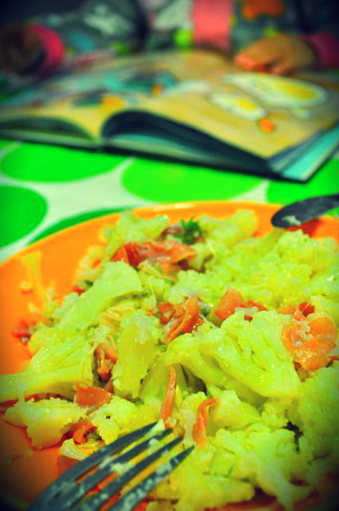
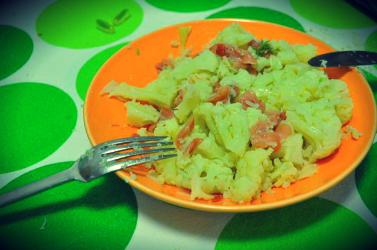
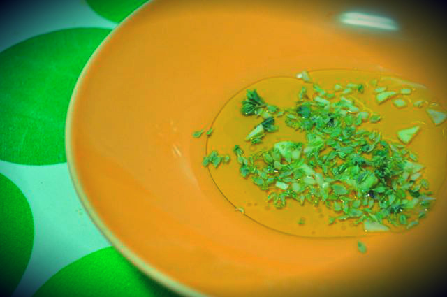

Apetecia-me um pequeno-almoço reconfortante. "Deixa ver o que encontro aqui no frigorifico...", pensei. "Uhmmmm couve-flor.... presunto.... tem de servir....". Enquanto preparava o pequeno-almoço da Inês cozi a couve-flor com água e sal. Preparei azeite, oregãos e vinagre num prato de sopa. Cortei 2 ou 3 fatias de presunto em tiras. Quando a Inês acabou de comer estava pronto. Foi só envolver tudo, rectificar temperos e comer a ouvir a história da Gansa Constança. 

  

Simples e do melhor!!!! Mais fotografias em baixo.

  

  

  

  

