[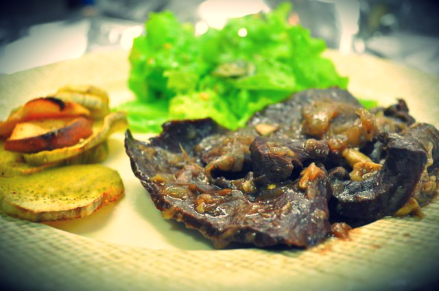](http://4.bp.blogspot.com/-n7-c8OQrgZo/UOi636CSjkI/AAAAAAAAFWU/oIYEP04UEnY/s1600/x2.jpg)

  

Esta semana comprei algumas carnes "menos nobres": coração de vitela, língua de vaca e moelas de galinha. Todas vão servir para mais alguns "2 em 1" (receitas para congelar). As minhas ideias são:

- Coração de vitela de cebolada (receita do talhante)
- Língua de vaca com molho de tomate
- Caril de moelas

Para evitar cozinhar amanhã, que é Domingo, resolvi fazer já hoje a comida toda do fim-de-semana. Como estava curioso relativamente ao coração, comecei por aí.

  

O talhante foi extremamente prestável: o coração já vinha limpo e feito em pequenos bifes. A carne tem um aspecto fantástico, apesar de visceral. O coração era "pequeno" de acordo com o talhante, mas não deixava de pesar 800 gramas. Temperei com sal e pimenta. Numa frigideira "puxei" duas cebolas em azeite, adicionei 5 ou 6 dentes de alhos esmagados e uma folha de louro. Juntei dois copos de vinho tinto pequenos e adicionei a carne. Deixei cozinhar durante 20 a 25 minutos, em lume brando, até o molho ficar apurado e os bifes tenros. No fim, adicionei 2 malaguetas frescas cortadas em pedaços (provei antes de adicionar a malagueta e esta última adição elevou o resultado final para outro patamar).

  

Produto inicial

[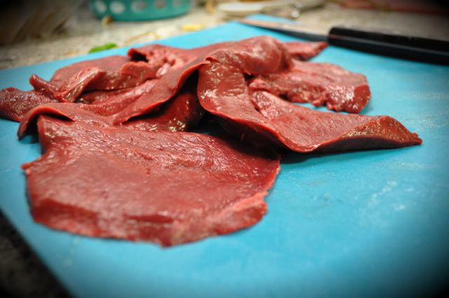](http://3.bp.blogspot.com/-Gsjx0pi7RRU/UOiwMqhFvFI/AAAAAAAAFUo/_iITjczZpAU/s1600/x5.jpg)

  

Quase no fim da cozedura, já com as malaguetas

[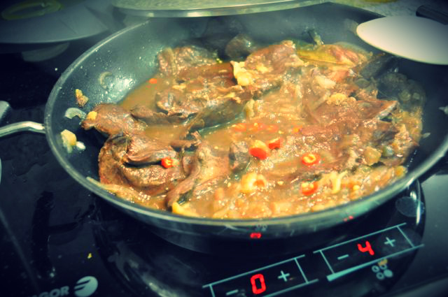](http://4.bp.blogspot.com/-i3nWVuUQPmU/UOixq8uJBeI/AAAAAAAAFVE/OCfvNR4vWuE/s1600/x11.jpg)

  

  

As malaguetas

[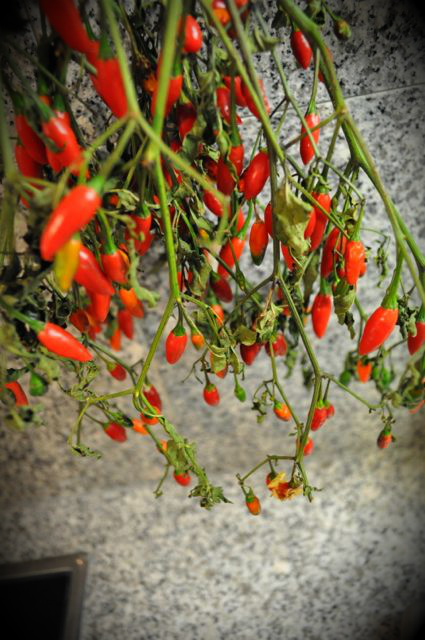](http://3.bp.blogspot.com/-vLa7SsHKgR4/UOixu5Klj8I/AAAAAAAAFVw/0BybNJ9h48c/s1600/x9.jpg)  
  
O prato final  
[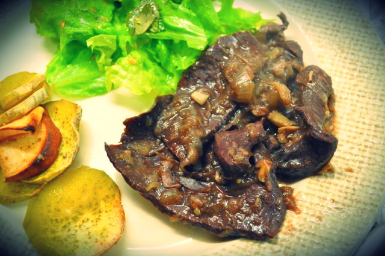](http://3.bp.blogspot.com/-bBgROAHo__s/UOiwK-6yFiI/AAAAAAAAFUE/ca_hyDk7ZaI/s1600/x3.jpg)

  

Para além do coração, fiz ainda uma sopa de espinafres, frango assado no forno com canela e ervas Provence, acompanhado de [maçãs reineta e batata doce assadas](http://www.saborespaleo.com/recipes/82) no forno e salada de alface.

  

Ingrediente da sopa, espinafres, abóbora, cenoura, cebola, batata doce, courgette, nabo e alhos.

[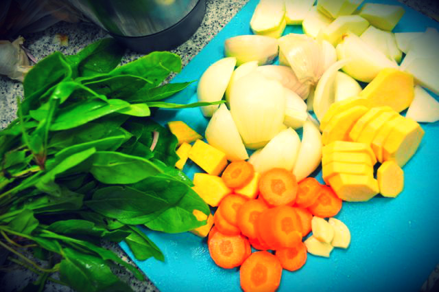](http://3.bp.blogspot.com/-MO7VRMw9QmE/UOixs1HcLGI/AAAAAAAAFVo/L5gsfn8-wjk/s1600/x14.jpg)

  

Os espinafres depois de arranjados e lavados

[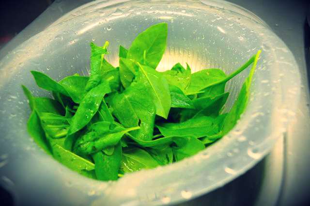](http://1.bp.blogspot.com/-kFO5VeIirOQ/UOiwMATcFOI/AAAAAAAAFUU/-ux2A_VaD-M/s1600/x4.jpg)

  

A sopa já no prato da Inês para arrefecer

[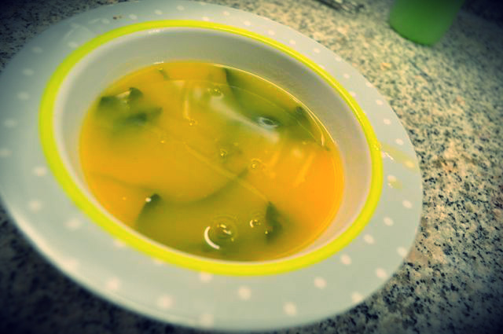](http://1.bp.blogspot.com/-u6mK_7TYuOA/UOiwMz7KzZI/AAAAAAAAFUc/LQqYo5xK7I0/s1600/x6.jpg)

  

 O frango temperado, antes de ir ao forno. Levou azeite, sal, pimenta, cebola às rodelas, ervas provence, canela e limão cortado aos cubos, tudo bem envolvido.[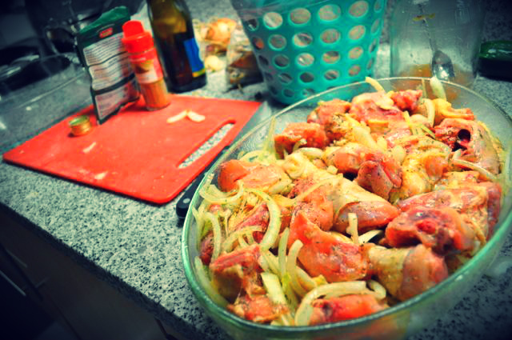](http://4.bp.blogspot.com/-JZ0pCGgZnyo/UOixrnJjK4I/AAAAAAAAFVM/YxH7NWzjsCs/s1600/x12.jpg)

  

 As batatas e maçã reineta assada a entrar no forno[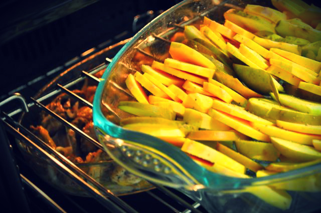](http://4.bp.blogspot.com/-OyHpMkjQd1E/UOixsE337QI/AAAAAAAAFVU/QnJlCf3gF5I/s1600/x13.jpg)

  

Salada de alface com coentros e sementes de linhaça

[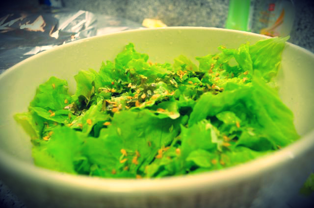](http://1.bp.blogspot.com/-uaJ_H-i5mi4/UOixqwFk2DI/AAAAAAAAFVI/DOgdPZry_Mk/s1600/x10.jpg)

  

Frango depois de cozinhado

[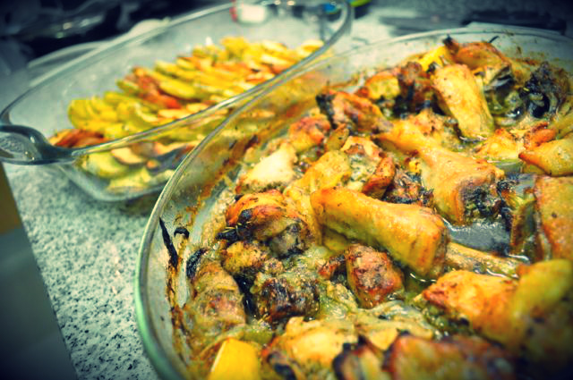](http://1.bp.blogspot.com/-6ZNF0T2SnGQ/UOixtHXTprI/AAAAAAAAFVg/rRlSLIYm7Ps/s1600/x7.jpg)

  

Batatas e maçã depois de cozinhadas

[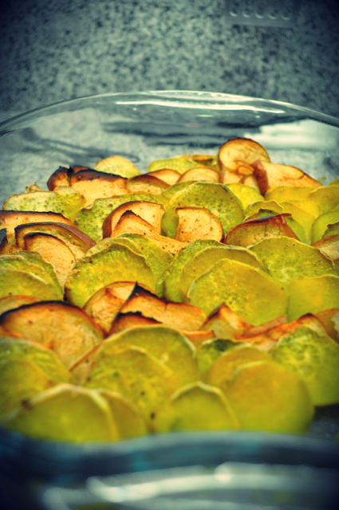](http://4.bp.blogspot.com/-6VP68BCCS7I/UOixtiLsy1I/AAAAAAAAFVk/l9fezC1fQ40/s1600/x8.jpg)
