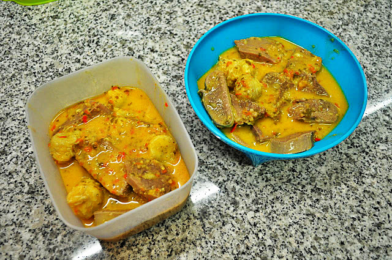
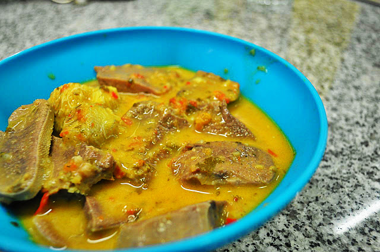
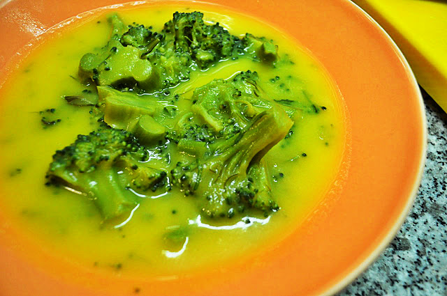
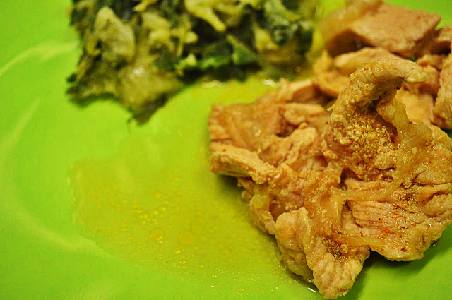

Como [referi há uns dias atrás](http://blog.cozinhadecaverna.com/2013/01/dia-611-2-em-1-corazon-espinado.html), comprei umas carnes "menos nobres" para fazer umas experiências. Hoje foi dia de dar destino a uma língua de vaca. A minha ideia inicial era fazer um caril mais "atomatado" (mais uma receita para congelar) mas julgo que não coloquei tomate suficiente....  
  

  

Comprei uma língua de vaca generosa, que cozinhei durante 15 minutos na panela de pressão, com água e grãos de pimenta preta. Depois da panela perder o vapor, tirei a pele da língua (que sai com muita facilidade). Cortei a língua às fatias. Fiz uma pasta de caril com um molho de coentros, um pedaço de gengibre fresco, 5 malaguetas frescas, 5 tomates chucha pequenos, 2 colheres de chá de mistura de especiarias para caril, 5 dentes de alho, um pouco de azeite, raspa de lima e sal, tudo triturado na Bimby. Provei para rectificar temperos. Aqueci bem a pasta de caril na panela de pressão (sem a tampa) e juntei a carne. Deixei cozinhar um pouco e adicionei uma lata de leite de coco. Deixei cozinhar 10 a 15 minutos. Juntei no fim 2 bananas cortas às rodelas. Um autentico pitéu! Vou comer amanhã ao almoço com "um monte" de cenoura ralada, antecedido de uma sopa de brócolos (foto mais em baixo).

  

  
  
Fiz ainda um creme de legumes com (bastantes) brócolos e bifes de perú de cebolada (ambos para congelar e/ou comer noutra refeição).  
  

  
  

