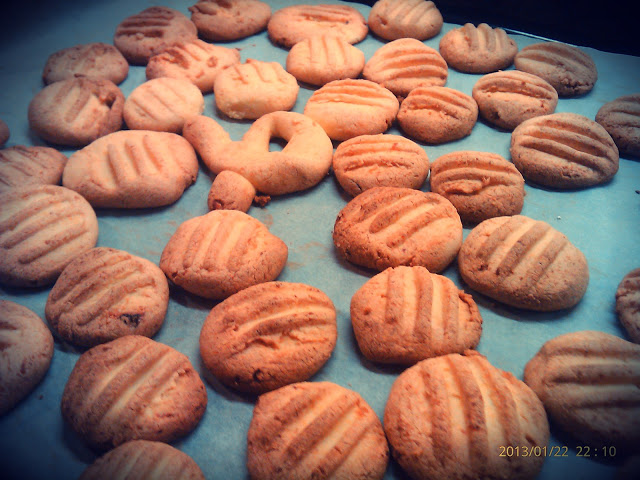

Receita original de uma "companheira" de dieta.  

  

Amolecer 100 gramas de manteiga no microondas (potência minima, 1 minuto). Misturar 60 gramas de mel. Numa taça à parte, amassar 200 gramas de fécula de mandioca (ou polvilho azedo)  com 1 ovo. Eu usei as mãos depois de envolver um pouco com uma colher. Juntar a manteiga à farinha e amassar novamente. A mistura pegou-se muito às mãos quando tentei amassar de inicio. Voltei à colher até estar tudo bem unido e depois terminei manualmente. Fiz bolas pequenas e esmaguei com um garfo. Cozinharam em 10 minutos num forno pré-aquecido a 200ºC. 

  

Ficaram boas mas de uma próxima vez vou experimentar adicionar raspa de limão e/ou uma especiaria (canela ou gengibre em pó).

  

