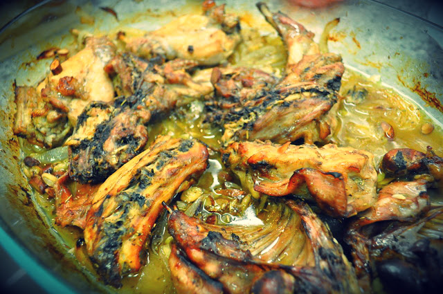
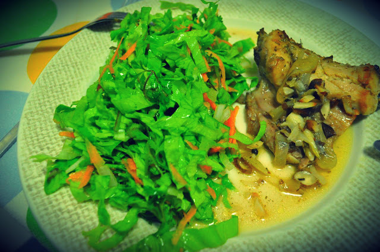
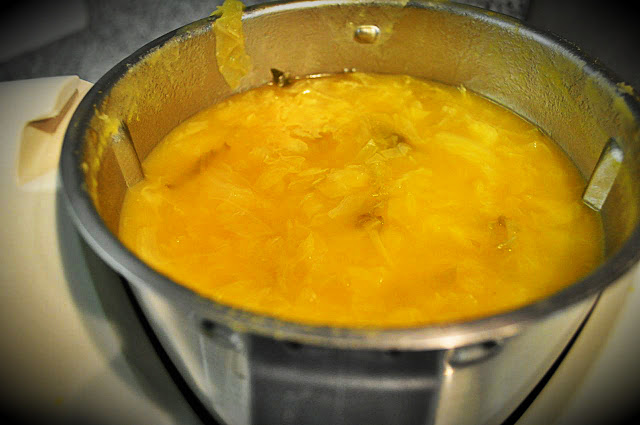
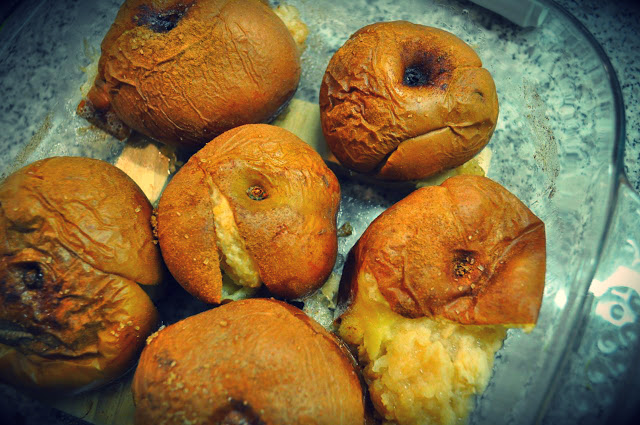

Hoje o prato principal foi coelho no forno com amêndoas, alecrim, moscatel e vinho branco, uma receita do [Vitor Sobral](http://www.vitorsobral.com/). Fiz assim: comprei um coelho e pedi ao talhante que o cortasse em pedaços maiores do que o normal. Em casa, lavei o "animal" e temperei bem com sal e pimenta. Forrei o fundo de um tabuleiro com cebola às rodelas e alhos esmagados. Coloquei o coelho, adicionei uma mão cheia de amêndoas picadas grosseiramente, alecrim e reguei tudo com moscatel, vinho branco e azeite. Assei no forno coberto durante 1 hora, a 150ºC. Destapei e deixei cozinhar mais 30 minutos a 180ºC, virando de vez em quando. 

  

Enquanto o coelho assava, fizemos uma sopa de lombardo, uma salada de alface, cenoura, cebola e coentros, e maçãs Reineta assadas com canela.

  

O coelho saído do forno

  

O coelho acompanhado de salada

  

Sopa de lombardo

  

Maçãs assadas com canela (julgo que a Vânia colocou um pouco de açúcar não refinado, mas nem se notava...)

