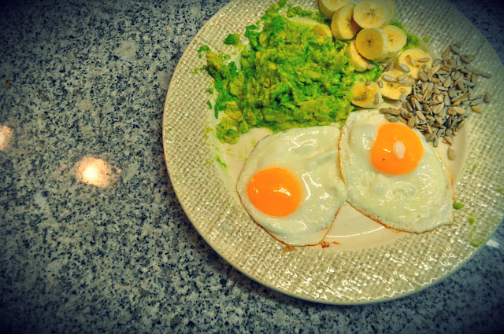

**Dia 1** do Whole30. 
  
Hoje chegou-me ao estomago:  

- **Pequeno-almoço**: ovos estrelados em óleo de coco com abacate, banana e sementes de girassol, café
- **Lanche manhã**: nada
- **Almoço**: lombos de garoupa com couve e cenoura cozida, café
- **Lanche tarde**: 2 maçãs
- **Jantar**: atum, brócolos cozidos, cenoura e 4 ou 5 quadrados de batata doce, bebida de cevada
- **Ceia**: nada

As maiores dificuldades foram:

- Ao almoço ia colocando no tabuleiro uma gelatina, por esquecimento que tinha iniciado isto do Whole30 (eheheh...)
- Depois do jantar, senti mesmo falta do chocolate negro

  

