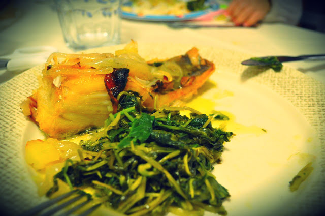
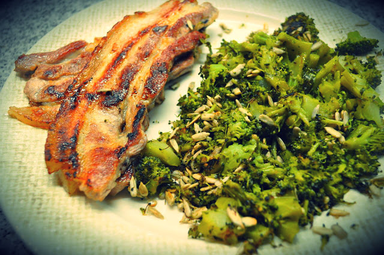

  
**Dia 2** do Whole30. 
  
Hoje chegou-me ao estomago:  

- **Pequeno-almoço**: entremeadas de porco grelhadas com brócolos cozidos salteados em óleo de coco e sementes de girassol, café
- **Lanche manhã**: maçã, 5 amêndoas
- **Almoço**: salada diversa, salsichas frescas grelhadas, café
- **Lanche tarde**: maçã
- **Jantar**: sopa de espinafres (sem batata) e bacalhau assado no forno com nabiça salteada
- **Ceia**: 10 amêndoas, 1 colher de torresmos que sobraram da banha de porco preto que estive a fazer

Dificuldades, ai o chocolate negro.... concluo que já estava viciado...  
  
Continuo a achar que vou enjoar os pequenos-almoços... ando a pensar se não salto uns quantos para não me fartar de comer ovos e carne.  
  

  

