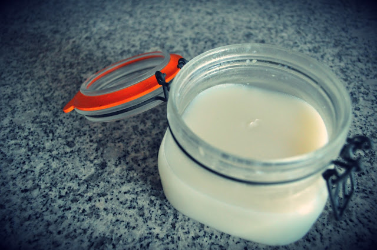

Video de demonstração mais em baixo.

_Demonstration video below._

  

Resolvi fazer banha de porco com o toucinho de porco preto biológico que tinha comprado. Segui a sugestão do talhante:  

1. Aquecer 1 colher de sopa de água num tacho
2. Adicionar o toucinho cortado aos cubos
3. Temperar com sal (para conservar durante mais tempo)
4. Deixar derreter em lume brando (na placa de indução, no 2) e ir recolhendo a banha liquida aos poucos para um recipiente à parte

No processo, que no total demorou cerca de 40 minutos, uma vez que nunca tinha feito esta experiência, tentei várias coisas:

- Tapar o tacho para que a banha começasse a derreter mais depressa
- Espremer o toucinho com um garfo para obter mais depressa a gordura

Os pedaços de toucinho que sobram são torresmos deliciosos (que não pude deixar de despachar de seguida...).

  

De uma próxima vez, julgo que vou comprar mais quantidade de toucinho e fazer no forno usando [outra técnica](http://paleolifter.wordpress.com/2012/09/08/banha-de-porco/).

  

Deixo um vídeo que mostra em detalhe como se faz.

  

  

<iframe allowfullscreen frameborder="0" height="315" src="http://www.youtube.com/embed/mK_edG3zTtA" width="560"></iframe>
