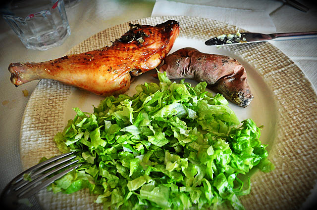
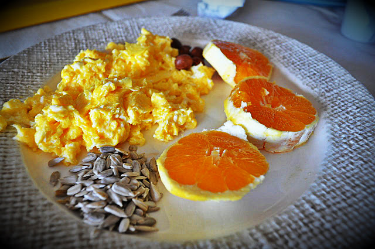

**Dia 3** do Whole30. 
  
Hoje chegou-me ao estomago:  

- **Pequeno-almoço**: ovos mexidos, sementes girassol, avelãs, laranja, café
- **Lanche manhã**: nada
- **Almoço**: salada alface, frango no forno, batata doce assada, maçã
- **Lanche tarde**: café, chouriço, fiambre e nozes
- **Jantar**: caldeirada de raia, brócolos (não comi batatas), laranja, café
- **Ceia**: nada

Ao jantar esqueci-me do Whole30 e bebi meio copo de vinho tinto (oopppssss...).  
  
Já não pensei tanto em chocolate negro.  
  

  

