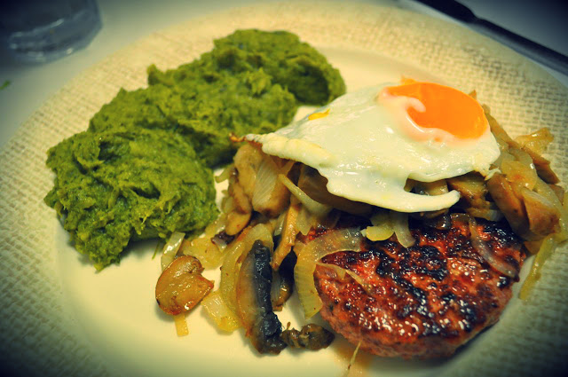

_Translate using the sidebar on the main page (or copy paste the content to [Google translator](http://translate.google.com/))._  
**Dia 4** do Whole30. 

  

Hoje chegou-me ao estomago:

- **Pequeno-almoço**: dois ovos estrelados, banana da madeira, sementes de girassol e avelãs
- **Lanche manhã**: nada
- **Almoço**: frango assado no forno com salada
- **Lanche tarde**: maçã
- **Jantar**: hambúrger com puré de brócolos, cebola, cogumelos e ovo estrelado
- **Ceia**: duas fatias de presunto, amêndoas

O puré de brócolos foi feito cozendo a vapor os mesmos e adicionando duas batatas doces cozidas médias. Triturei tudo e temperei com sal, azeite e vinagre (na realidade usei a Bimby, cozi as batatas no copo e os brócolos na Varoma tudo ao mesmo tempo, triturando depois tudo na velocidade 7). Enquanto os brócolos e as batatas coziam, "puxei" a cebola e os cogumelos numa frigideira usando [banha de porco preto](http://blog.cozinhadecaverna.com/2013/02/dia-640-banhada-da-meia-noite-midnight.html). Reservei. Na mesma frigideira fritei os hamburgers. Reservei. Voltei a colocar a cebola e os cogumelos, adicionei uma colher de chá de mel e deixei cozinhar mais um pouco. Ao mesmo tempo, noutra frigideira, estrelei os ovos usando um pouco de óleo de coco. Servi tudo junto. Que pitéu! 

  

  

