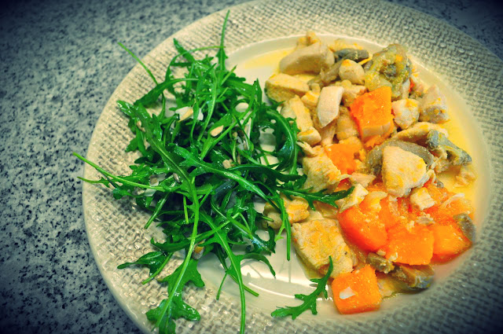
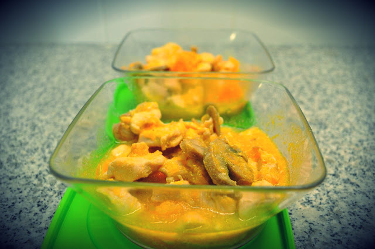

Tenho andado ocupado, a pensar [noutras coisas](http://mnmlist.com/) e longe da Internet. No entanto o Whole30 continua de pedra e cal, hoje já no dia 16. Tenho tido festas, bolos e doces que alguém leva para o trabalho e jantares. Todavia, ainda não vacilei e julgo que desta vez vai até ao fim. Ultrapassei a vontade de comer chocolate e já nem penso nisso. Tenho-me sentido muito bem.  

  

Hoje fiz um almoço à pressão, peito de frango com abóbora e cogumelos, baseado numa imagem que tinha na cabeça de carne com abóbora, memória de um _blog_ do qual já não me consigo recordar. Como os peitos eram grandes, ainda sobrou para outras refeições, tendo-se traduzido num boa receita de comida para congelar.

  

Cortei três peitos de frango ao cubos. Cortei uma cebola média às rodelas. Cortei meia abóbora menina aos cubos. Num tacho refoguei um pouco a cebola, em [banha de porco preto](http://blog.cozinhadecaverna.com/2013/02/dia-640-banhada-da-meia-noite-midnight.html), adicionei uma lata de cogumelos laminados e cinco minutos depois a abóbora. Deixei cozinhar dois ou três minutos e adicionei a carne. Temperei tudo com sal e pimenta. Coloquei uma tampa no tacho e deixei cozinhar até a abóbora estar macia, mexendo de vez em quando. Ficou surpreendentemente bom.

  

Depois de uma sopa de brócolos, acompanhámos o frango com uma salada de rúcula, sementes de sésamo e lascas de coco, temperada com azeite, vinagre e um fio de mel.

  

Deu para três (a Inês comeu pouco) e ainda sobrou para dois almoços da próxima semana.

