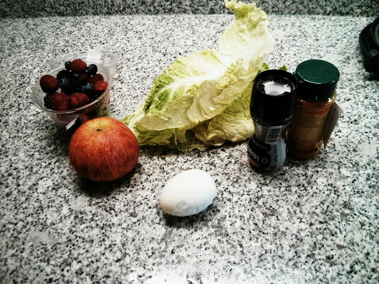
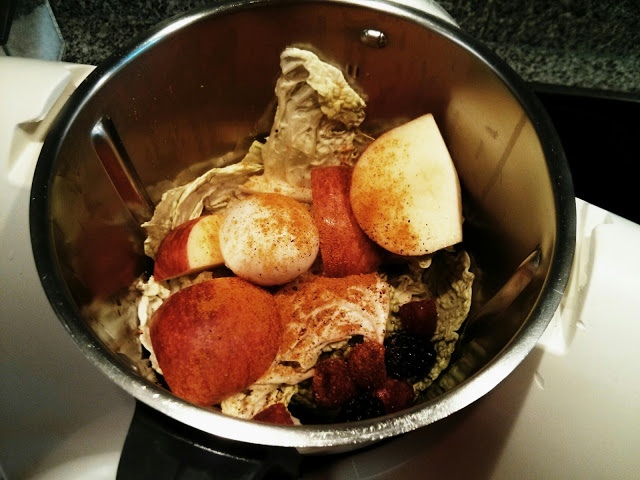
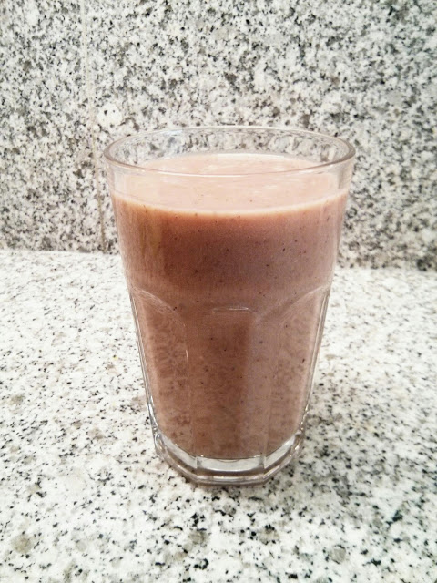

Ando a ler o livro [Anticancer: A New Way of Live](http://www.anticancerbook.com/book.html). Uma das ideias para fortalecer o organismo contra o cancro ou abrandar a sua proliferação passar por beber batidos que contém determinados [alimentos](http://www.eattodefeat.org/foodlist) que indiciam ser eficazes neste objectivo.

  

Citando (posição 2427 no kindle):

> _A combination of components in food has a much more greater effect than a single component. Alone, one component reduces the risk of breast cancer in **[mice](http://en.wikipedia.org/wiki/Mice)** exposed to a powerfull carcinogen. Four components administered together lower the risk by 90%._

A minha primeira tentativa for à base de couve lombardo, maça, frutos vermelhos, ovo cozido, pimenta e cúrcuma. Era "bebível" mas não o consideraria "bom". Amanhã faço outra tentativa. 

  

  

  

  

 
