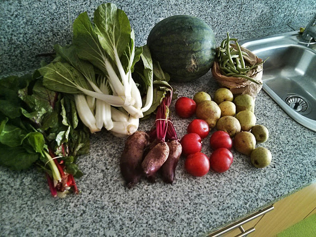
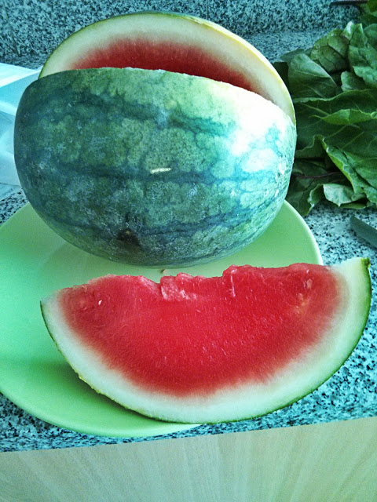

Descobri esta semana os mercados AgroBio que têm como objectivos:

> _Facilitar o acesso aos produtos de Agricultura Biológica e o incentivo à produção e consumo locais, de produtos frescos e da época, promover relações de confiança entre produtores e consumidores, bem como circuitos curtos de comercialização, com preços acessíveis, mas também mais justos para o produtor (...), existindo actualmente 11 mercados biológicos semanais de Norte a Sul de Portugal: Aveiro, Loures, Amadora, Oeiras, Algés, Cascais, Carcavelos, Lisboa – Campo Pequeno, Almada – Cacilhas, Setúbal, Portimão._ 

A lista de mercados com as respectivas localizações está disponível aqui: [http://www.agrobio.pt/pt/mercados-agrobio.T194.php](http://www.agrobio.pt/pt/mercados-agrobio.T194.php).

  

Estive no mercado de Setúbal hoje. Apesar de ter apenas duas bancas de venda, os produtos tinham muito bom aspecto. Azar dos azares, não levei o cartão de débito e só pude gastar os 12,45 EUR que tinha na carteira. Foram completamente usados nos produtos que é possível ver na foto em baixo.

  

Os vegetais tinham sido apanhados de manhã, as ameixas são muito boas e a melância bastante vermelha (e aprovada pela Inês).

  

  

  

  

  

  

