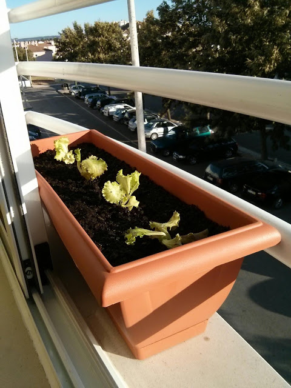
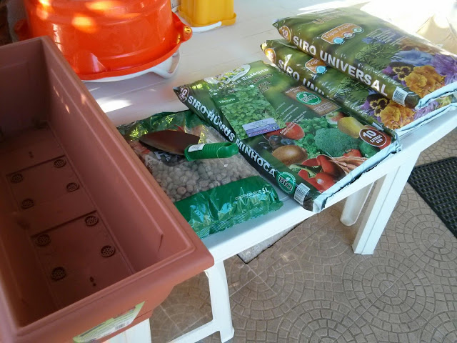
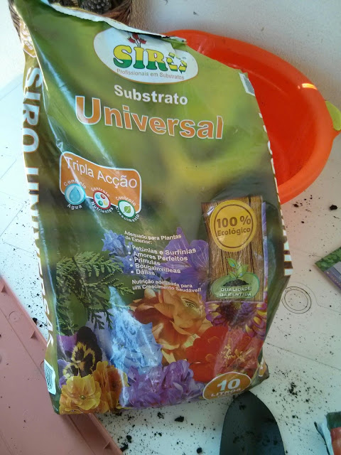
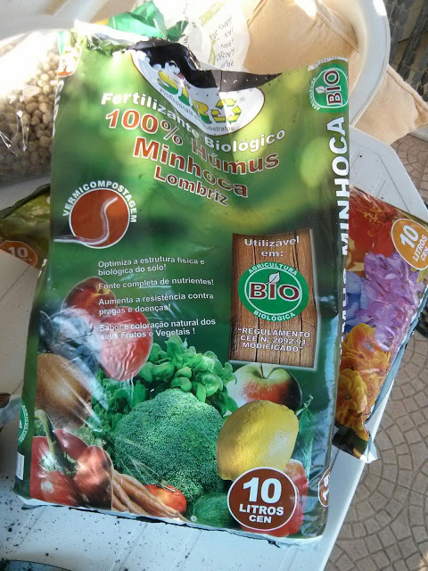
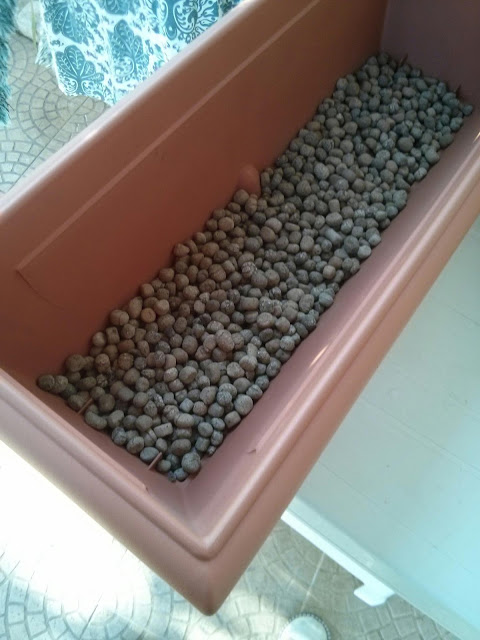
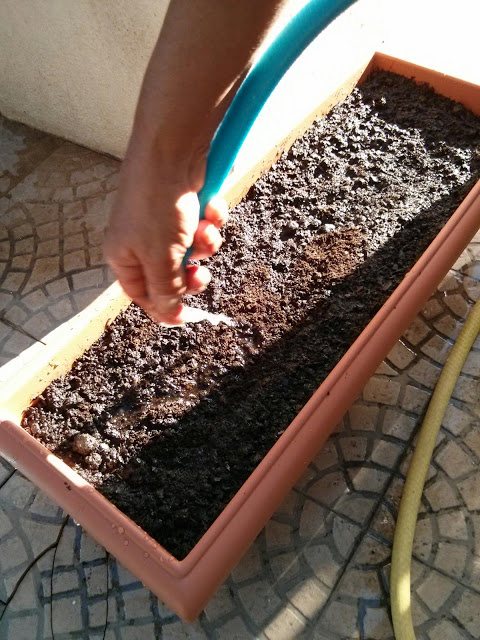
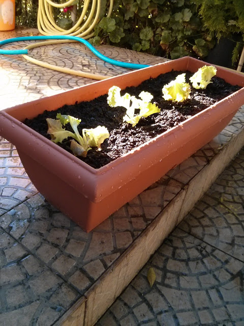
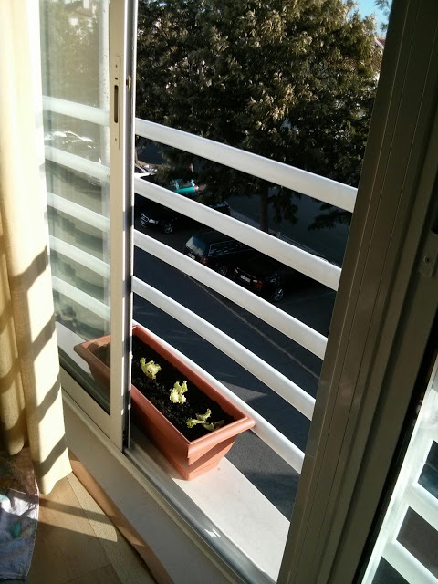

Um dos livros que ando a ler é sobre Permacultura, nomeadamente no contexto urbano, que é o que me interessa mais (não estou a planear ir viver para o campo nos próximos tempos... mas nunca se sabe...). Inspirado e motivado pela abordagem de auto sustentação, resolvi fazer uma experiência de cultivo de alfaces em casa. 

  

Comecei "pequeno", com uma pequena floreira com capacidade para 4 alfaces "apertadinhas". 

  

Fiquei agradavelmente surpreendido pela quantidade de pessoas interessadas no tema do cultivo vegetais numa horta ou mesmo na varanda. Aderi no Facebook a dois grupos que têm entre 2000 e 4000 pessoas, em Português. Foi num destes grupos que solicitei alguma informação sobre como começar. Usando o seu _feedback_ e algumas pesquisas na Internet, resultou no que apresento de seguida. Fiz o trabalho no quintal dos meus pais e levei para casa a floreira já "composta".

  

As quadro alfaces no seu novo lar, numa das minhas janelas viradas a oeste. Apanham sol das 12h às 20h no Verão.

  

  

O material: floreira, argila expandida, fertilizante biológico, substracto universal (comprei a mais... 20 litros...), 4 alfaces para plantar, uma embalagem de sementes de salsa (para o futuro) e uma pá. Um _kit_ que custou 20 EUR.

  

  

  

  

  

Primeiro passo, cobrir o fundo da floreira com a argila. Li vários artigos a recomendar este procedimento para evitar que as alfaces fiquem muito ensopadas quando regadas.

  

Misturei o substracto com o fertilizante, usando as mãos. Adoro mexer na terra e foi uma experiência fantástica. Acho que a abusei no fertilizante. 10 litros de substracto e cerca de 5 de fertilizante. Só depois é que vi as recomendações na embalagem do fertilizante e deveria ter usado muito menos... enfim espero não "afogar" as alfaces em alimento. 

  

As "meninas" instaladas.

  

Agora na sua morada final.

 
