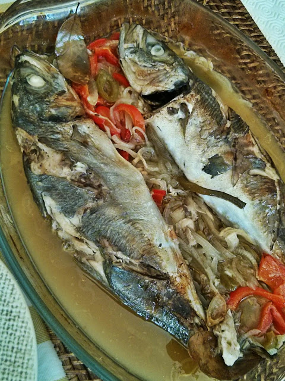
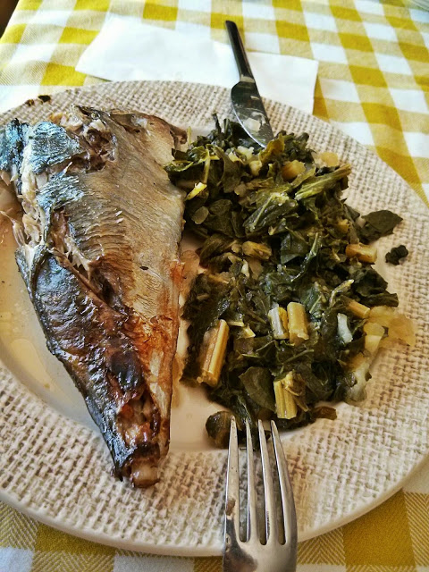

No sábado fui com a Inês à praça comprar peixe para o almoço. Resultado: chicharros assados no forno com couves "à moda da avó". 

  

Assados no forno são mais a especialidade da Vânia mas de vez em quanto toca-me a mim, que nunca sei bem como fazer. Como é normal, inventei um bocado... o peixe já vinha arranjado (sem tripas, escamas e com uns cortes lombares), foi só colocar num tabuleiro de ir ao forno com cebola, pimento vermelho e verde, louro, vinho branco e um pouco de jeropiga. Temperei tudo com sal e levei ao forno pré-aquecido 45 minutos a 1 hora. Ao mesmo tempo cozi couves cortadas em tiras e 5 batatas pequenas, que esmaguei com um garfo e temperei com azeite e vinagre. O assado sabia a caldeirada mas todos gostaram.

  

  

 
