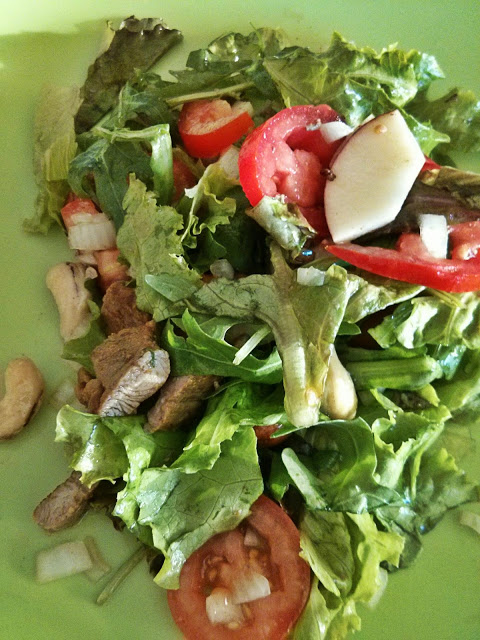

Foi o nosso jantar um destes dias: uma salada com peito de pato.

  

Comprei dois peitos de pato que cortei às tiras, temperei com sal, pimenta e [curcuma](http://en.wikipedia.org/wiki/Turmeric), misturando tudo com as mãos. Enquanto as tiras de pato grelhavam (numa frigideira ou grelhador de fogão) preparei alface, tomate, maçã, rúcula, cebola, caju, amêndoas e avelãs. Juntei as tiras de pato depois de arrefecidas e temperei tudo com azeite e vinagre. 

  

 
