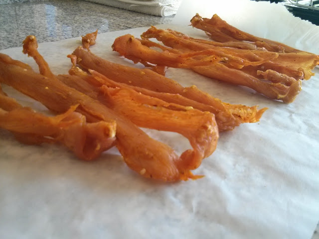
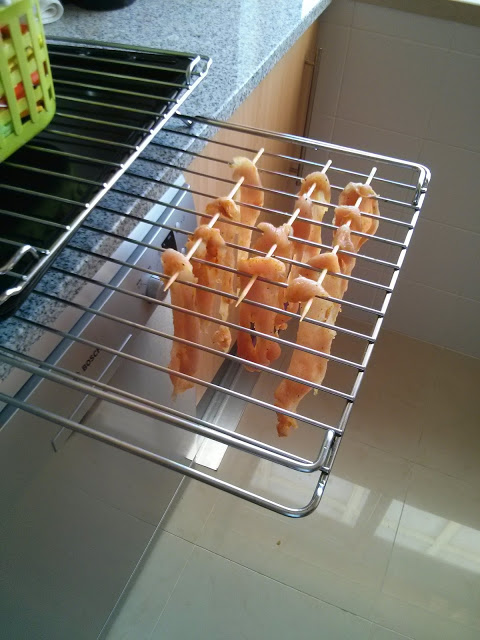
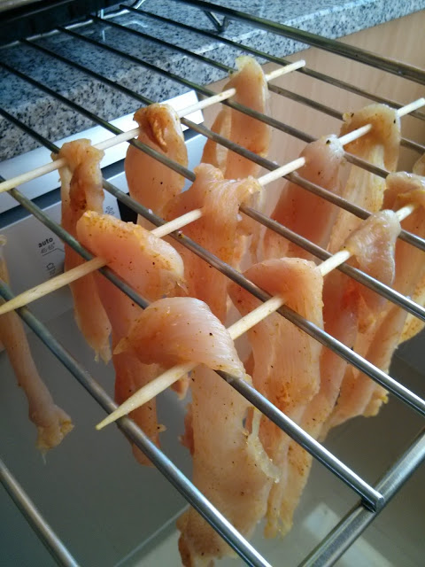
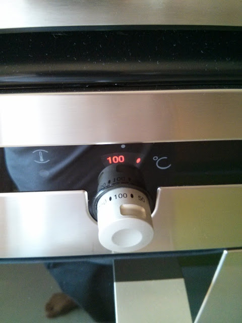
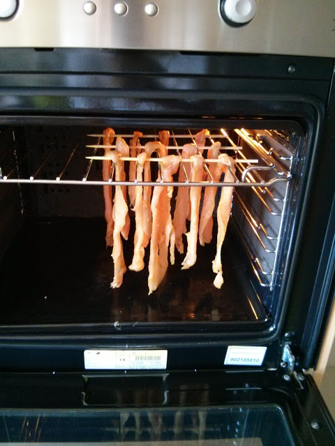
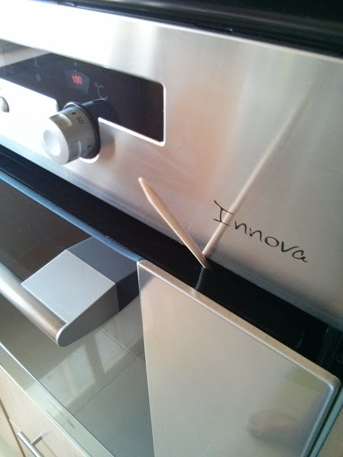
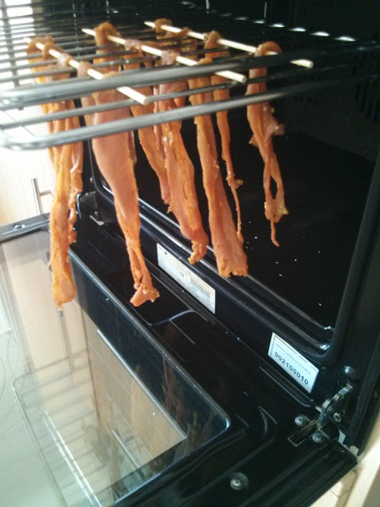
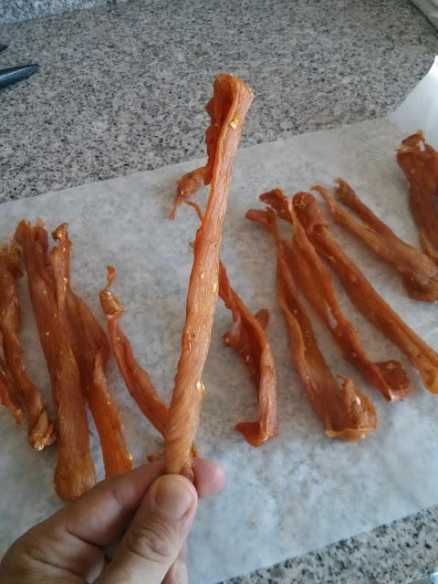

  
  
Este fim-de-semana fui ao supermercado para comprar fiambre de peru, algo que já não há cá em casa há 1 ou 2 anos (nem sei bem ao certo...).  

> _\- Boa tarde, faça favor de dizer..._  
> _\- Boa tarde, quero fiambre de peru, posso primeiro ver os ingredientes?_  
> _Olhou para mim com cara estranha e saiu por uma porta. Voltou com uma embalagem de fiambre de peru aberta, que colocou em cima da bancada, esperando que eu fosse ver os ingredientes._  
> _\- Esta embalagem já não tem ingredientes. Posso ver outra?_  
> _Outra vez a cara estranha._  
> _\- Não tenho outra menino._  
> _\- E esta aqui que está aqui? Espere, acho que dá para ver daqui de fora, não necessita de tirar._  
> _Carne de peru (55%), fécula de batata, proteina de soja, leite em pó, etc._  
> _\- Deixe estar, obrigado. Não vou levar._  
> _"E agora?" pensei eu. "E se fizesse peru seco? Acho que em tempos vi uma receita a passar algures.". Google.com. Turkey Jerky. Resultado, [How to Make Turkey Jerky (That’s Super Easy and Tastes Like Thanksgiving)](http://www.marksdailyapple.com/how-to-make-turkey-jerky-thats-super-easy-and-tastes-like-thanksgiving). "Perfeito". Dirigi-me ao talho._  
> _\- Boa tarde._  
> _\- Boa tarde, diga..._  
> _\- Quero peito de peru mas cortado de uma maneira diferente._  
> _\- Isto normalmente corta-se em bifes_  
> _\- Pois, eu sei, mas quero fazer outra coisa... deixe lá ver os pedaços de peito que aí tem... esse aí... queria cortado assim \[gesto\], o mais fino que conseguir._  
> _\- Assim?_  
> _\- Não consegue mais fino?_  
> _\- Não, mais fino desmancha-se tudo._  
> _\- Não faz mal, não necessito de bifes inteiros. Deixe ver como está a ficar. Acho que está bom assim._  
> _\- Mas o que vai fazer com isto?_  
> _\- Vou secar._  
> _Cara estranha a olhar para mim._  
> _\- Para comer como snack, ao lanche por exemplo, fica bom._  
> _Cara estranha a olhar para mim._  
> _\- Em vez de comer fiambre, que é só porcaria. Já leu os ingredientes? Só tem 55% de carne._  
> _Cara estranha a olhar para mim._  
> _\- Aqui tem._  
> _\- Obrigado. Se ficar bom depois trago-lhe um pedaço para provar. Um bom resto de dia para si._  
> _Cara estranha a olhar para mim._  
> _"Eheheheh."_

Fiz de acordo com a receita do Mark's Daily Apple, tendo apenas adicionado curcuma aos restantes temperos (sal e pimenta), ou seja:  

1. Cortar peito de peru em tiras muito finas
2. Temperar com sal, pimenta e curcuma (um pouco mais do que o normal)
3. Espetar em palitos e colocar na grelha do forno
4. Levar ao forno, pré aquecido a 90º, durante 6 a 10 horas (no meu caso foram 5)
5. Deixar a porta do forno "entre-aberta"

  

Ficam as fotos do processo.

  

  

  

  

  

  

  
  

