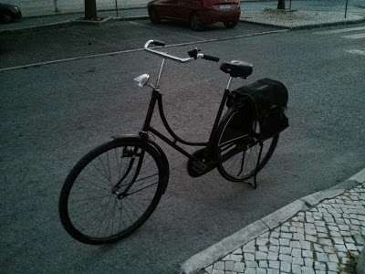
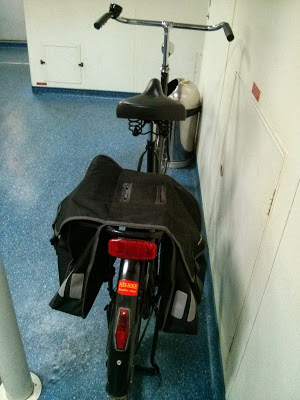
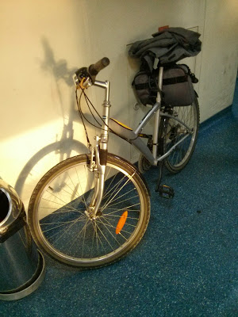
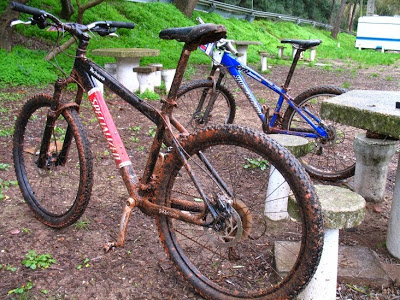
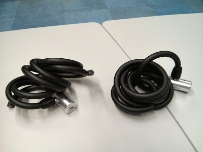
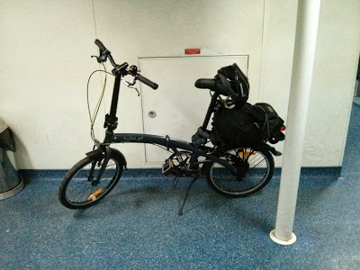

_a versão curta_

  

Estou a ir de bicicleta para lisboa e está a correr bem. Recomendo. Basta arranjar uma bicicleta, dois ou três cadeados muito fortes para evitar assaltos (aprendi isto por conta própria...) e começar a pedalar. Descobrir os melhores caminhos e como ultrapassar os obstáculos é só uma questão de tempo. 

  

_a versão longa (com mais detalhes que os maias)_

  

Deixem-me ver como tudo começou... acho que foram uma série de factores mas o principal responsável por esta alteração foi um acontecimento de vida muito negativo. Como é meu hábito, tento sempre analisar cada situação como uma oportunidade e identificar vantagens mesmo o caso seja muito mau. 

  

Passou a ser a vânia a levar a inês à escola e eu ganhei tempo de manhã. 

  

Ainda não "acertei" com uma rotina sustentável de exercício físico. Acho cada vez mais que os seres humanos e o _fitness_ só são verdadeiramente compatíveis quando não existe uma separação da rotina diária. A grande dificuldade que enfrento (ou enfrentamos) é que a minha (ou nossa) rotina diária é andar de carro ou sentado em transportes públicos e trabalhar sentado numa secretária, gastando nestas duas actividades entre 10 a 12 horas. Neste cenário, com filhos à mistura, arranjar 1 a 2 horas extra e motivação para treinar, é muito difícil.  
  
Substituir parte dos transportes (no meu caso, carro e metro) pela bicicleta permite incluir uma componente de exercício na rotina diária que sou obrigado a cumprir para chegar ao trabalho. 

  

Por isso, resolvi, numa sexta-feira, dia em que geralmente não uso fato no trabalho, ir de bicicleta para lisboa. 

  

Um ou dois dias antes, fui à arrecadação e enchi os pneus da "velha" bicicleta que usei nos [tempos da holanda](http://2malparidos.blogspot.pt/2007/08/bicicletas.html). Não sabia bem em que estado estava. as câmeras de ar das rodas estavam coladas mas insistindo, consegui que o ar entrasse. Não tinham furos. Dei uma volta de 5 kms. Já tinha saudades da _oma fiets_. Passei na decathlon e comprei dois cadeados.  
  

<table cellpadding="0" cellspacing="0" style="-webkit-text-stroke-width: 0px; font-family: Times; letter-spacing: normal; margin-bottom: 0.5em; margin-left: auto; margin-right: auto; orphans: auto; padding: 6px; text-align: center; text-indent: 0px; text-transform: none; widows: auto; word-spacing: 0px;"><tbody><tr><td style="text-align: center;">

</td></tr><tr><td style="font-size: 13px; padding-top: 4px; text-align: center;">
a&nbsp;<i>oma fiets</i>
</td></tr></tbody></table>

<table cellpadding="0" cellspacing="0" style="margin-left: auto; margin-right: auto; text-align: center;"><tbody><tr><td style="text-align: center;"></td></tr><tr><td style="text-align: center;">a <i>oma fiets</i> no barco</td></tr></tbody></table>

A _oma fiets_ é fantástica. Trouxe-a da holanda numa caixa fornecida pela transportadora aérea, por 60 EUR. custou 150 EUR nova e foi o meu transporte durante a minha estadia em Utrech, durante 7 ou 8 meses (já não sei ao certo...). Não tem mudanças e trava quando se pedala para trás.

  

Saí de casa cedo. Cheguei ao terminal fluvial mais depressa do que se tivesse ido de carro. da minha casa o percurso não tem subidas. Chegado a lisboa, optei pela Almirante Reis pois é a opção que me leva à Avenida João XXI com as subidas mais fáceis. Sem mudanças não posso dizer que foi fácil, mas mesmo assim consegui chegar ao trabalho em 20 minutos (a contar do momento em que saí do barco) em estado aceitável, ainda que um pouco suado.  

  

No fim do dia, no regresso a casa, ainda passei pela [miosotis](http://www.biomiosotis.com/), enchi os alforges de produtos bio, e segui via Duque d'Ávila, Fontes Pereira de Melo, Avenida da Liberdade, baixa, até chegar ao Terreiro do Passo (confesso que descer a Fontes Pereira de Melo, pela faixa do bus, taxis a "fazer razias", com uma bicicleta maior que o normal, sem travões, carregada de comida, não é experiência a repetir - principalmente sem capacete).

  

Na segunda-feira seguinte, resolvi fazer nova experiência: ir de fato vestido e usar uma bicicleta com mudanças e travões normais. Pedi a bicicleta citadina ao meu sogro e aí fui eu. Usei o mesmo percurso, tendo apenas subido a Almirante Reis mais devagar e com menos esforço graças à ajuda das mudanças. mesmo com o casaco vestido, cheguei ao trabalho em melhores condições do que na sexta-feira anterior com a _oma fiets_.  
  

<table cellpadding="0" cellspacing="0" style="-webkit-text-stroke-width: 0px; font-family: Times; letter-spacing: normal; margin-bottom: 0.5em; margin-left: auto; margin-right: auto; orphans: auto; padding: 6px; text-align: center; text-indent: 0px; text-transform: none; widows: auto; word-spacing: 0px;"><tbody><tr><td style="text-align: center;">

</td></tr><tr><td style="font-size: 13px; padding-top: 4px; text-align: center;">
a bicicleta do meu sogro no barco
</td></tr></tbody></table>

O problema foi o regresso. Nesta altura ainda estava muito calor no fim do dia. Cheguei a casa num estado impróprio para consumo (e o fato idem). 

  

No dia seguinte, fiz outra tentativa. Levei a minha bicicleta todo terreno, fui equipado com capacete, calções acolchoados, sapatos de encaixe, etc. Na mochila coloquei uma camisa e as calças do fato, o mais bem dobradas que consegui. Levei toalha, gel de banho e chinelos. Foi uma boa experiência visto que não tive que me conter no esforço e pude fazer um treino mais à séria, pois tomei banho no trabalho. No regresso a casa, voltei a vestir o equipamento de BTT. Sem dúvida a melhor solução, que repeti durante o resto da semana.  
  

<table cellpadding="0" cellspacing="0" style="clear: left; margin-bottom: 1em; margin-left: auto; margin-right: auto; text-align: center;"><tbody><tr><td style="text-align: center;"></td></tr><tr><td style="text-align: center;">a minha (agora ex) bicicleta todo-o-terreno</td></tr></tbody></table>

Foi nesta fase que aconteceu o pior desta experiência. Roubaram-me a bicicleta!!! Ahhhhhrggg!!! Como é possível? Da porta do emprego, com câmeras de vigilância e tudo?!?!? Podia ter sito mais cauteloso e ter adivinhado que isto iria acontecer visto que a bicicleta tinha algum valor comercial. Os cadeados foram cortados como se fossem manteiga. 

  

Andei uns dias sem saber o que fazer. A experiência estava a correr muito bem e é fantástico não ter que utilizar carro nem o metro. Frustado pelo assalto, não sabia se devia continuar ou desistir desta ideia. Comecei a pensar em alternativas, onde podia deixar uma bicicleta? Alugar um espaço numa garagem? Comprar uma bicicleta de 50 EUR no OLX? Comprar uma dobrável, colocar dentro de uma mala e ter a bicicleta junto de mim no trabalho?  
  

<table cellpadding="0" cellspacing="0" style="clear: right; margin-bottom: 1em; margin-left: auto; margin-right: auto; text-align: center;"><tbody><tr><td style="text-align: center;"></td></tr><tr><td style="text-align: center;">os cadeados cortados</td></tr></tbody></table>

Depois de andar uma semana novamente de transportes, resolvi que não podia desistir. A experiência estava a ser demasiado boa para voltar ao normal. Decidi então comprar uma dobrável e experimentar levar a bicicleta comigo para o posto de trabalho. 

  

Pesquisei um pouco e resolvi comprar a b-fold 7 na decathlon. É uma bicicleta com 7 velocidades, dobrável em menos de 30 segundos e com cerca de 13 kgs. Tem uma mala incluída.  
  
Esta bicicleta, apesar de pequena, "rola" bastante bem. Ao fim de uns minutos a pedalar, fiquei rapidamente habituado e fã. A ida até ao trabalho correu bem, tendo demorado sensivelmente o mesmo tempo que necessitei para fazer o caminho com bicicletas normais. A parte pior foi que a dobrável, apesar de caber dentro da mala, não é prática para transportar dentro da mesma.  
  
Tive que arriscar e voltar a deixar a bicicleta na rua. No entanto, desta vez, estou a tentar prevenir-me, utilizando três cadeados muito mais fortes (está mais protegida que outras bicicletas do parque que são mais caras) e  removendo o banco da bicicleta (para reduzir o interesse na mesma).  
  

<table cellpadding="0" cellspacing="0" style="margin-left: auto; margin-right: auto; text-align: center;"><tbody><tr><td style="text-align: center;"></td></tr><tr><td style="text-align: center;">a b-fold no barco</td></tr></tbody></table>

Nos últimos dias tenho alternado os caminhos, usando, por exemplo, a Avenida da Liberdade e Fontes Pereira de Melo para "subir". Para "baixo" tenho optado por trajectos com menos trânsito do que a Almirante Reis.  
  
Espero conseguir manter esta prática durante bastante tempo. Estou a ganhar forma física e tenho a barriga mais "seca" (não muito mas já se nota). O mau tempo está a chegar e vou ter que recorrer ao equipamento que usava no inverno quando estive na Holanda, ou seja, casaco e calças impermeáveis.  
  
Em resumo, consigo aproveitar o tempo que até agora era perdido (a andar de carro e de metro), faço exercício, tenho tempo para apreciar lisboa, poupo dinheiro e ainda me divirto.  
  
Muito muito muito bom. recomendo.  
  
Quem vive em lisboa, pode tirar partido das inúmeras ciclovias que estão a ser criadas por toda a cidade (http://lisboaciclavel.cm-lisboa.pt/).
