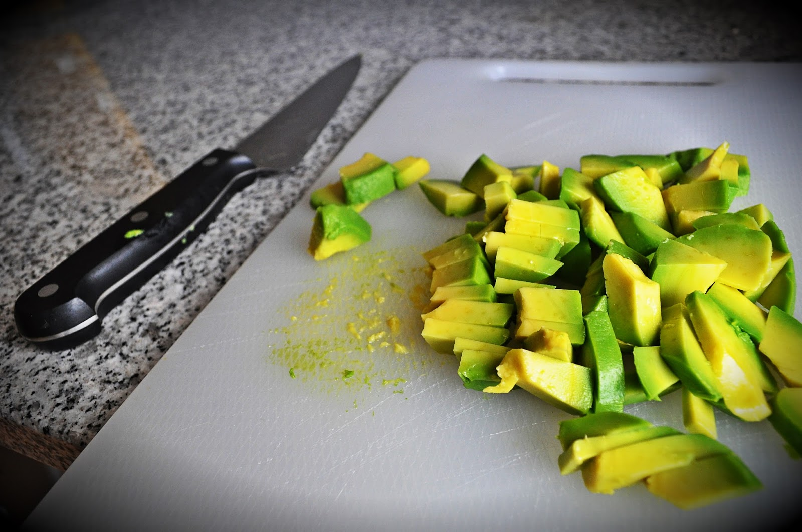

o resultado final: ovos mexidos com pêra abacate e sementes tostadas

  

 principais ingredientes: ovos caseiros / biológicos, pêra abacate e óleo de coco

  

 tostar sementes de girassol e caju numa frigideira anti aderente, mexendo frequentemente para não deixar queimar

  

cortar a pêra abacate em pedaços pequenos

  

mexer os ovos em óleo de coco e um pouco antes estarem prontos, adicionar a pêra abacate, temperando com sal e pimenta no final
