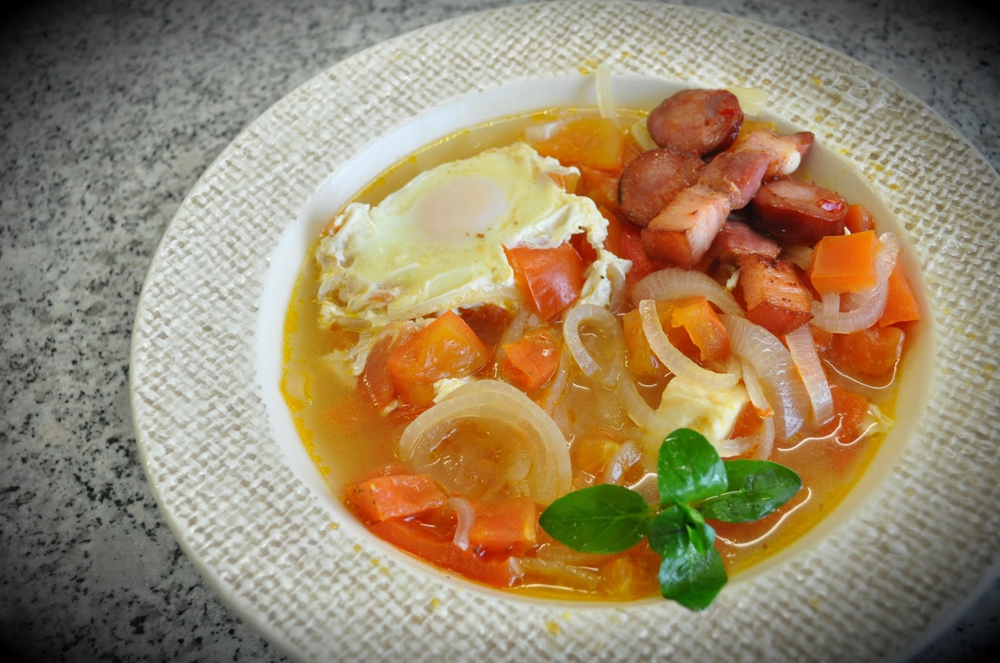

Numa das minhas ultima estadias no Alentejo, comi duas ou três vezes sopas de tomate (com o pão incluído confesso...). Fiquei rendido. Há uns dias atrás tentei fazer pela primeira vez.  
  

  
Vi um conjunto de receitas e decidi pela que me parecia ser mais [tradicional](http://videos.sapo.pt/FHWVYjFUHIHPYwdBNW7D). No entanto, julguei ter um dos principais ingredientes (bacalhau...) e só na altura de confeccionar a receita reparei que não tinha.  
  
Ficou razoável apesar de não estar igual às que comi no Alentejo. Sobrou para o dia seguinte (pequeno-almoço) e o sabor já estava mais apurado. Para a próxima não posso falhar com o bacalhau.  
  
Os ingredientes foram (deu para comer 4 vezes...):  

- Tomate cortado aos cubos (não tirei a pele mas devia ter tirado)
- Cebola picada
- Alhos fatiados
- Ovos
- Queijo cabra curado (opcional)
- Pimento vermelho
- Chouriço
- Bacon
- Louro
- Azeite
- [Banha porco preto](http://blog.cozinhadecaverna.com/2013/02/dia-640-banhada-da-meia-noite-midnight.html)
- Sal
- Pimenta
- Poejos frescos

  

  

Fritar o bacon e o chouriço na banha e no azeite e reservar.

  

  

Adicionar os restantes ingredientes e cobrir com água. Deixar cozinhar. No fim, adicionar os ovos e escalfar.

  

  

  

  

.
