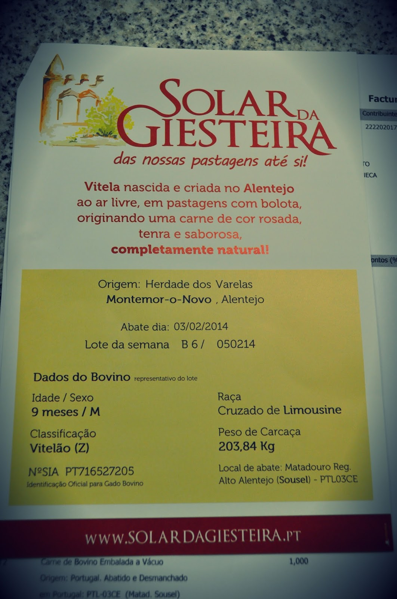
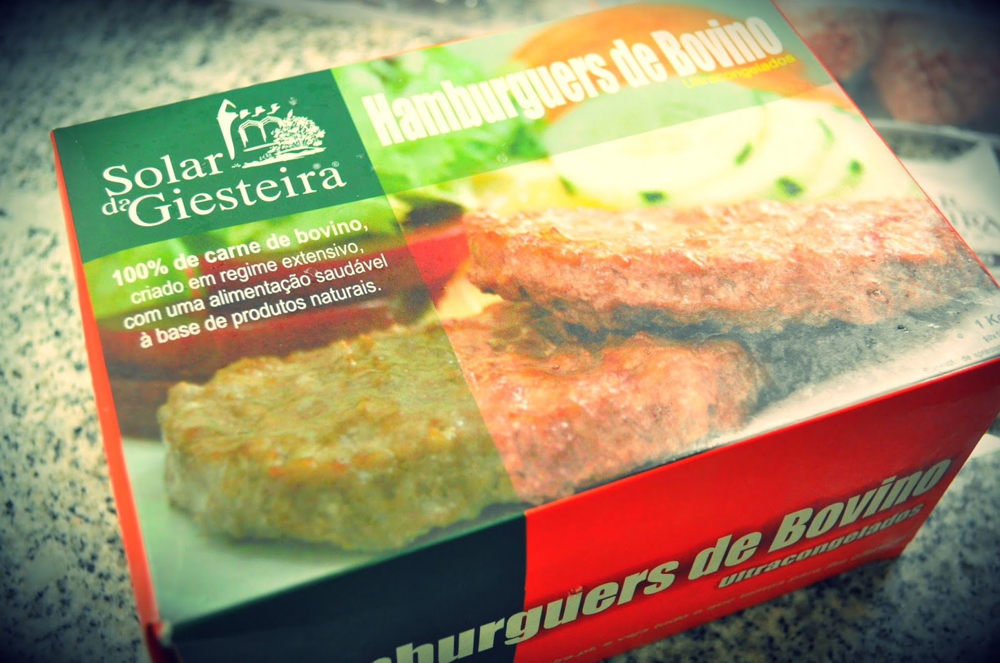
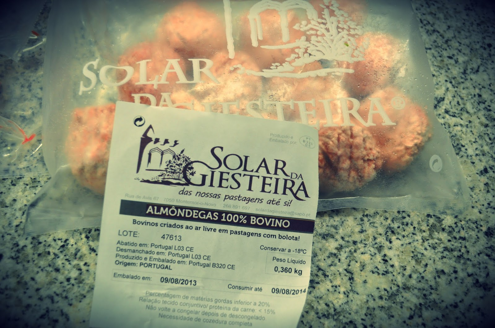
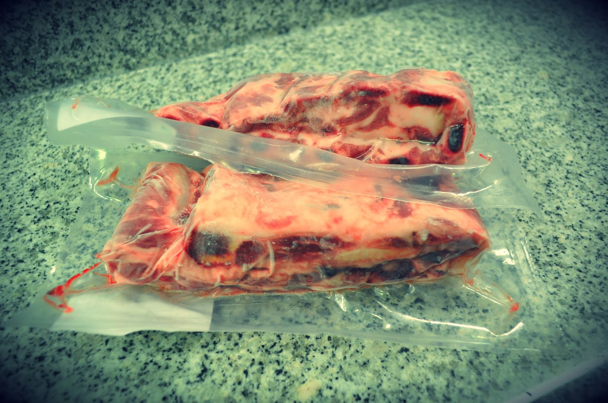
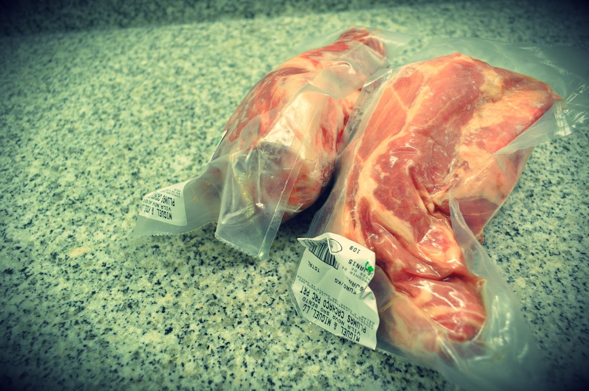
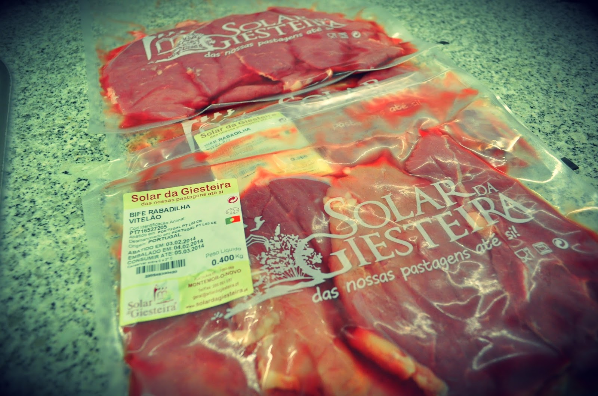
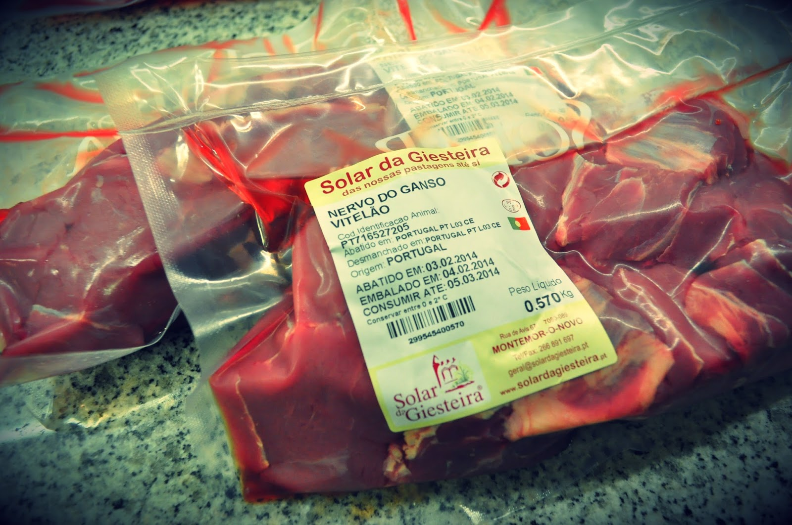
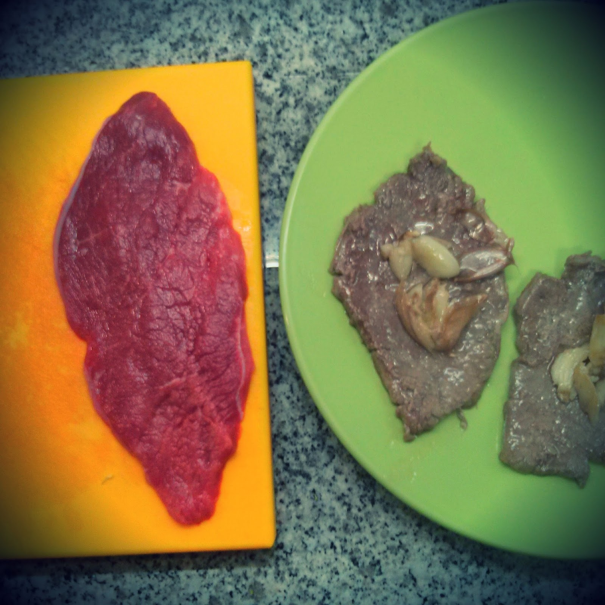

Esta semana encomendei pela primeira vez carne do Solar da Giesteira, que cria vitelas ao ar livre em pastagens com bolota. Já andava para o fazer há mais tempo mas confesso que fui empurrado pela leitura do livro [Defying Age With Food](http://defyingagewithfood.com/).

  

Fiz a encomenda a partir do [_site_ do Solar da Giesteira](http://solardagiesteira.pt/), escolhi algumas peças (um bocado às escuras visto que não conheço grande parte dos tipos de carne de vaca/vitela) e concluí a encomenda que incluiu produtos de vaca (congelados e frescos) e de porco preto.

  

As entregas são gratuitas apesar de terem dias específicos de entrega por zona (mais informação [aqui](http://solardagiesteira.pt/?page_id=821)). Têm pagamento por multibanco, contra entrega do produto. No mesmo dia, por e-mail, recebi a confirmação da entrega no horário que tinha solicitado (sexta-feira, de manhã) e uma questão sobre como queria a carne cortada.  No dia anterior à entrega, recebi uma SMS a indicar que a encomenda seria entregue entre as 9h30 e as 10h. 

  

A entrega correu bem, com bastante pontualidade (9h45). Quando cheguei a casa depois do trabalho, "inspeccionei" a encomenda (ver fotos em baixo) e tinha tudo muito bom aspecto. Achei interessante incluirem informação sobre a vitela utilizada para retirar a carne fresca. A carne congelada é a de porco e os hamburguers e almôndegas. A rabadilha veio cortada em bifes em embalagens de 400~500 gramas, o ideal para nós os três cá em casa. O nervo do ganso veio preparada para estufar. A carne fresca vem embalada para congelação imediata.

  

Experimentei hoje a rabadilha e, apesar de ter deixado os bifes fritar demasiado o que os tornou um pouco mais duros, a carne é bastante saborosa. Fiz um pequeno vídeo que podem ver aqui: [instagram.com/p/kNUI2AoXbz](http://instagram.com/p/kNUI2AoXbz).

  

Conclusão: apesar de não ter provado ainda todos os produtos, a primeira experiência foi positiva. A encomenda e entrega correu bem e a carne que já cozinhei era bastante saborosa. Se continuar a correr assim, certamente farei mais encomendas.

  

 

  

Hamburguers 100% de Bovino

  

Almôndegas 100% de Bovino

  

Entrecosto de Porco Preto

  

Plumas de Porco Preto

  

Bife de Rabadilha

  

Nervo do Ganso (já cortado em pedaços para estufar)

  

Bife de Rabadilha antes e depois de cozinhado (distraí-me e cozinhou em demasia)

