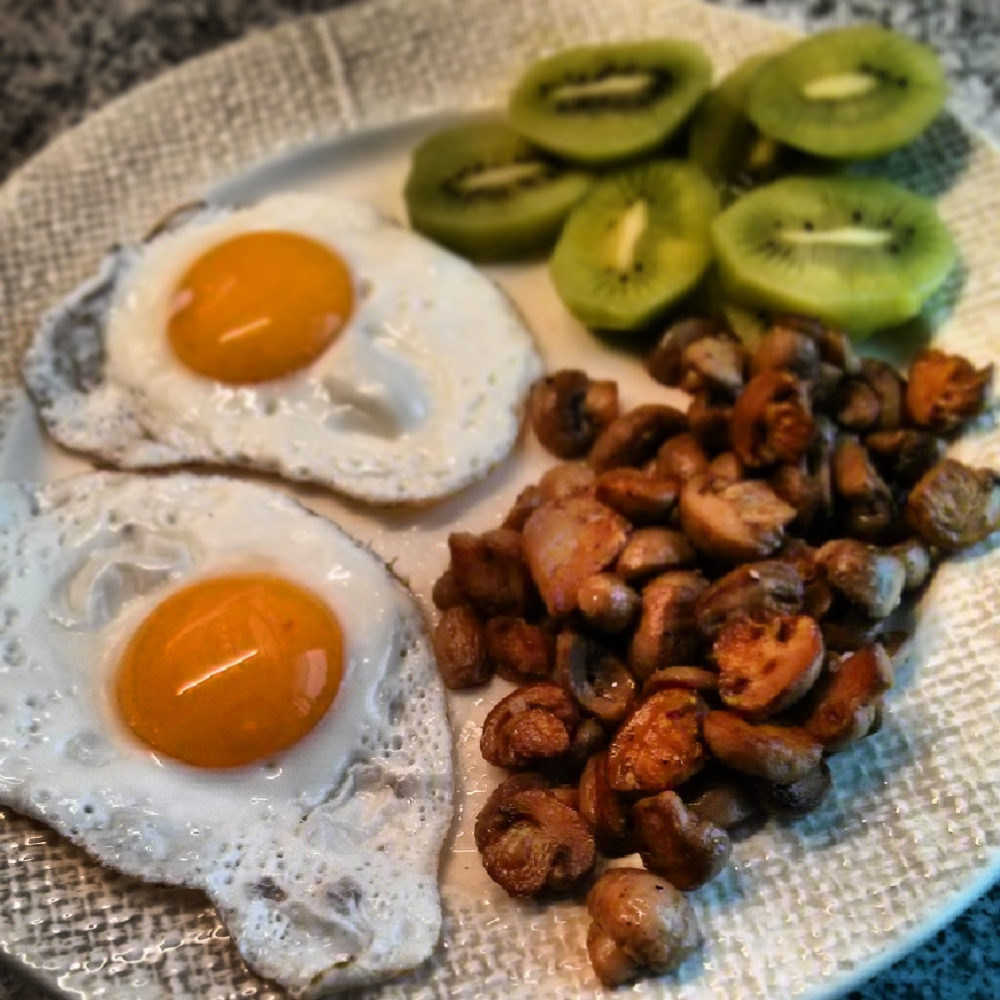

  
**usei:**  
\- 2 ovos  
\- 1 lata de cogumelos  
\- 2 kiwis pequenos  
\- 1 c. chá de banha de porco preto  
\- sal e pimenta q.b.  
  
**como fiz:**  

1. aquecer uma frigideira
2. lavar cogumelos e cortar ao meio se não forem laminados
3. derreter banha na frigideira e adicionar os cogumelos
4. temperar com sal e pimenta
5. mexer frequentemente até os cogumelos estarem cozinhados
6. retirar os cogumelos
7. estrelar os ovos na mesma frigideira
8. servir tudo com os dois kiwis laminados
