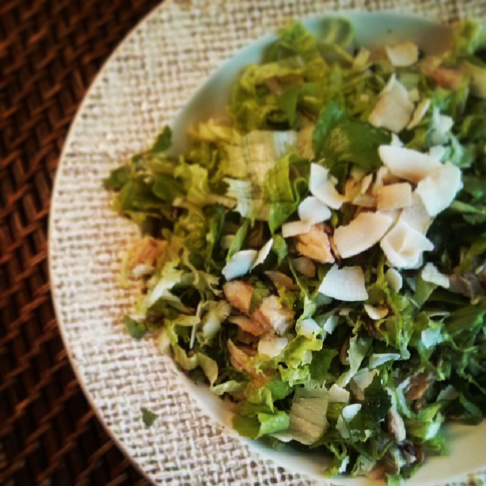

  
**usei:**  
\- 1 lata de cavalas em azeite picante  
\- alface q.b. para uma pessoa  
\- coentros q.b.  
\- 1 c. sopa de sementes de girassol  
\- 1 c. sopa de flocos de coco  
\- sal, pimenta q.b.  
\- azeite, vinagre q.b.  
  
**como fiz:**  

1. lavar a alface
2. colocar as sementes a tostar numa frigideira antiaderente, mexendo de vez em quando, com cuidado para que não fiquem queimadas
3. cortar a alface em juliana
4. picar os coentros de forma grosseira
5. cortar a cavala aos cubos
6. juntar os ingredientes num prato e temperar com sal, pimenta, azeite e vinagre

  

Fiz um pequeno video no instagram que podem ver aqui: [http://instagram.com/p/l9NRODoXdo/](http://instagram.com/p/l9NRODoXdo/)
