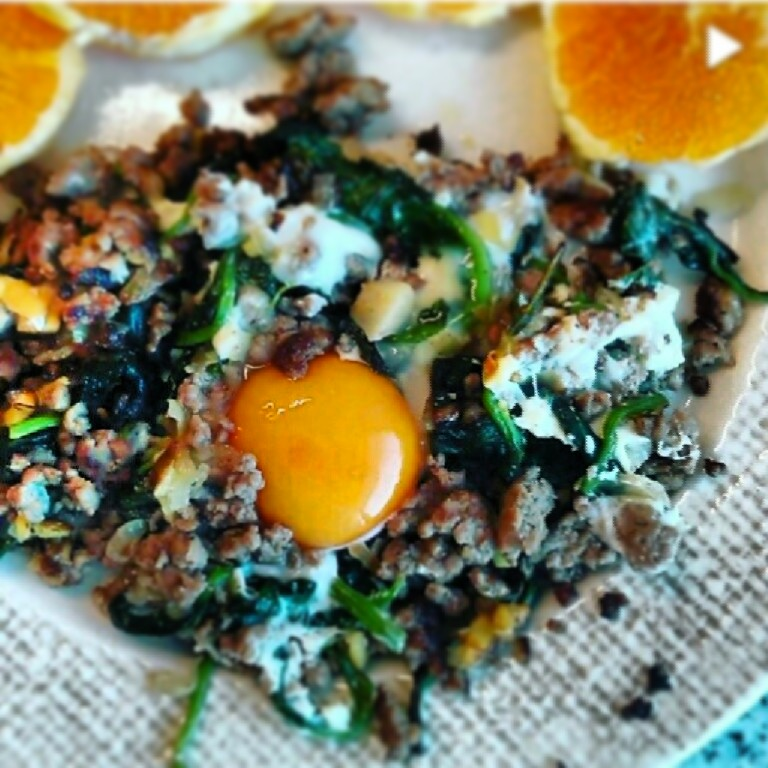

  
**usei:**  
\- 1 hambúrguer desfeito  
\- 1 molho de espinafres pequeno  
\- 1 ovo  
\- 1/2 cebola pequena picada  
\- 1 cubo de gengibre fresco picado  
\- azeite  
\- sal e pimenta  
  
**como fiz:**  

1. numa frigideira, saltear em azeite a cebola e o gengibre picados.
2. adicionar a carne, temperar com sal e pimenta e deixar cozinhar, mexendo de vez em quando.
3. reservar a carne.
4. saltear os espinafres na mesma frigideira.
5. adicionar a carne aos espinafres e envolver.
6. colocar um ovo por cima e deixar cozinhar a clara.
7. servir com uma laranja às rodelas.

  

Sugestão de "degustação": quebrar a gema ainda liquida para que envolva parte dos restantes ingredientes. A combinação da carne ligeiramente tostada com o gengibre e a cremosidade da gema tornam este pequeno-almoço fantástico.

  

Fiz um pequeno video no instagram que podem ver aqui: [http://instagram.com/p/l\_zXTYoXZd/](http://instagram.com/p/l_zXTYoXZd/)
