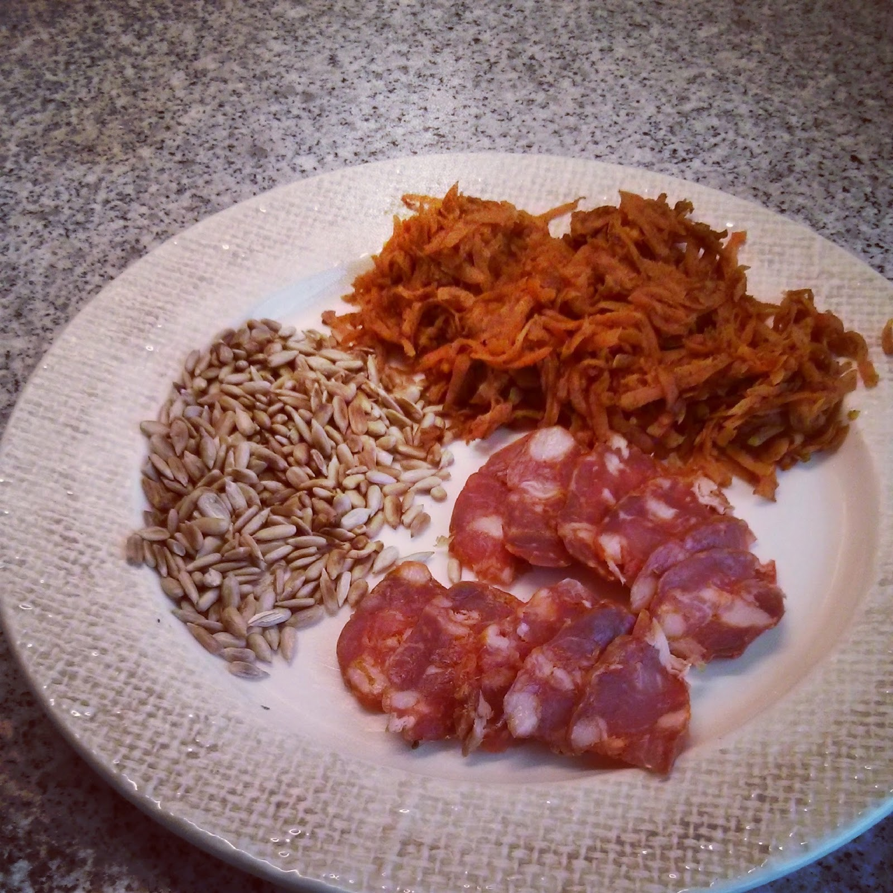

  

**usei:**

\- 2 cenouras médias raladas

\- 1 mão cheia de sementes de girassol

\- 1 pedaço de chouriço

\- 1 cubo de gengibre picado

\- oléo de coco

\- canela q.b.

  

**como fiz:**

1. tostar as sementes numa frigideira e reservar.
2. aquecer o oléo de coco na frigideira e adicionar o gengibre.
3. juntar a cenoura e deixar cozinhar mexendo sempre, se a cenoura ficar muito seca, juntar um pouco de água.
4. adicionar canela à cenoura e envolver bem.
5. servir a cenoura e as sementes com algumas rodelas de chouriço.

  

Fiz um breve vídeo ilustrativo que podem ver aqui: [http://instagram.com/p/mCaK-3IXeg/](http://instagram.com/p/mCaK-3IXeg/)
