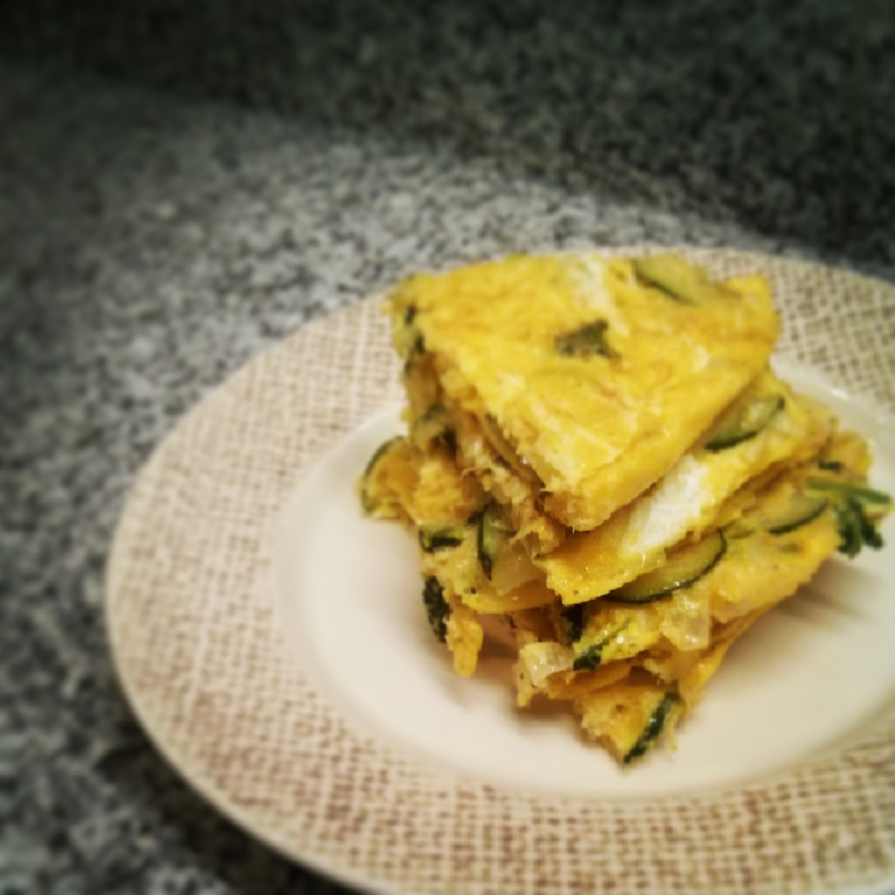

  

**usei:**

\- 3 ovos

\- 1/2 courgette pequena cortada às rodelas finas

\- parte branca de um alho francês pequeno cortada às rodelas finas

\- 1 c.sopa de coentros picados  
\- óleo de coco  
\- sal e pimenta  
  
**como fiz:**  

1. numa frigideira saltear em óleo de coco a courgette, o alho francês e os coentros, temperando com sal e pimenta.
2. bater os ovos numa taça e misturar os vegetais salteados, envolvendo bem.
3. colocar a mistura na frigideira e deixar cozinhar, virando a meio a tortilha com a ajuda de um prato.

  

Em [http://instagram.com/p/mE3b2dIXRL](http://instagram.com/p/mE3b2dIXRL) é possível ver um vídeo ilustrativo.
