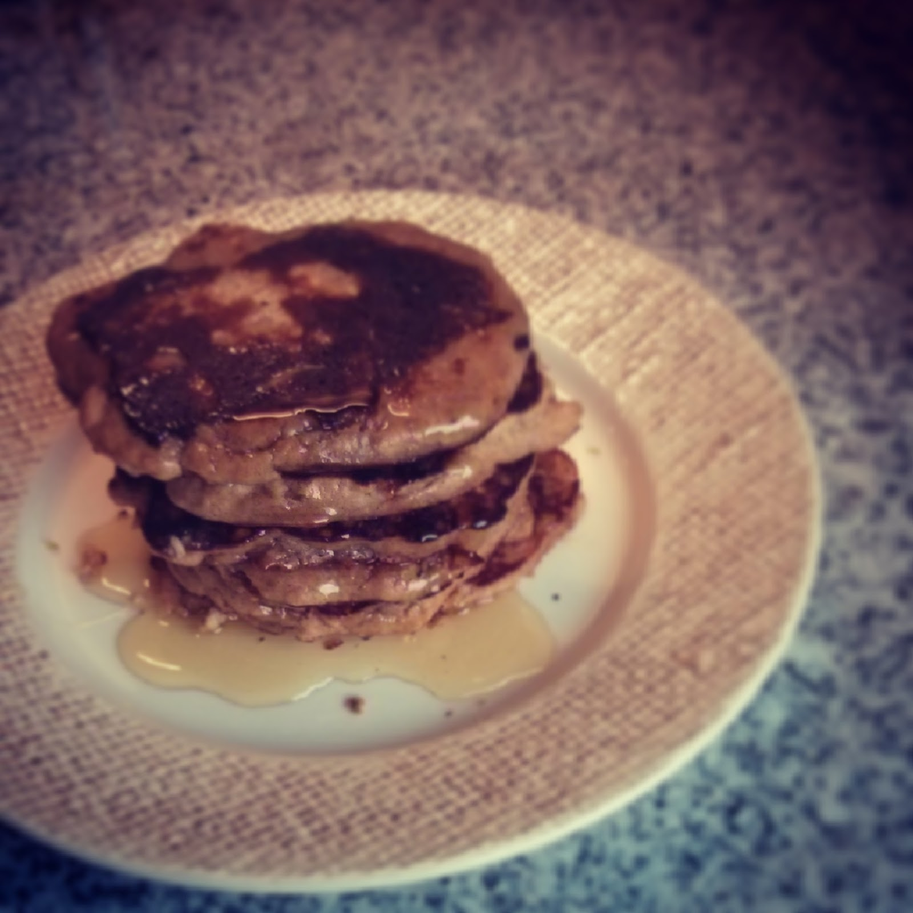

  

Imitações "Paleo" não são o meu forte mas hoje apeteceu-me fazer panquecas. Segui a [receita da NomNomPaleo](http://nomnompaleo.com/post/9199871590/cinnamon-and-coconut-pancakes) substituindo o leite de coco por chá de canela com um pouco de óleo de coco. Servi com mel.

  

Vídeo disponível em [http://instagram.com/p/mHm0WsoXYe/](http://instagram.com/p/mHm0WsoXYe/).
