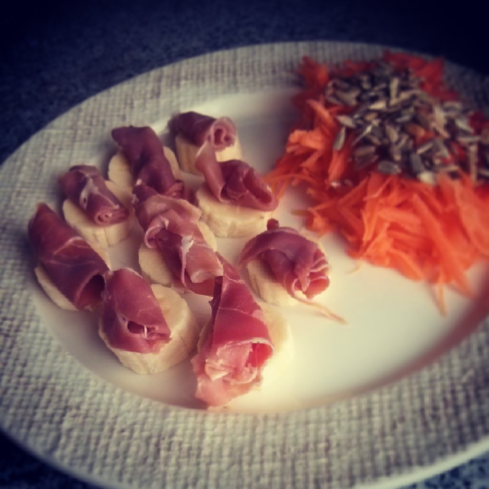

  

**usei:**

\- 3 fatias de presunto

\- 1 banana da madeira grande

\- 2 cenouras médias

\- uma mão cheia de sementes de girassol

  

**como fiz:**

1. tostar as sementes numa frigideira anti-aderente
2. cortar as fatias de presunto em 3 ou 4 pedaços e enrolar
3. ralar a cenoura
4. cortar as bananas às rodelas e colocar os rolos de presunto em cima
