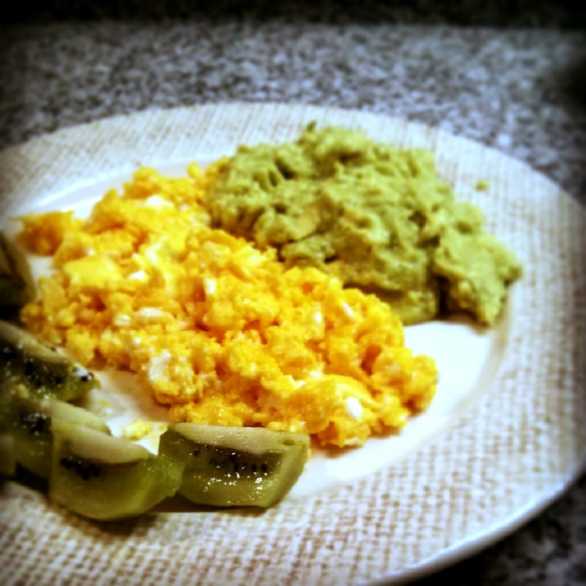

  

**usei:**

\- 3 ovos

\- 2 kiwis pequenos

\- 1 pêra abacate

\- manteiga de vaca

\- sumo de limão

\- sal, pimenta branca e picante 

  

**como fiz:**

1. mexi os ovos com um pedaço de manteiga
2. esmaguei o abacate e temperei com sal, pimenta, sumo de limão e picante
3. servi tudo com os kiwis

  

Video em [http://instagram.com/p/mRtQjaoXW9/](http://instagram.com/p/mRtQjaoXW9/).
