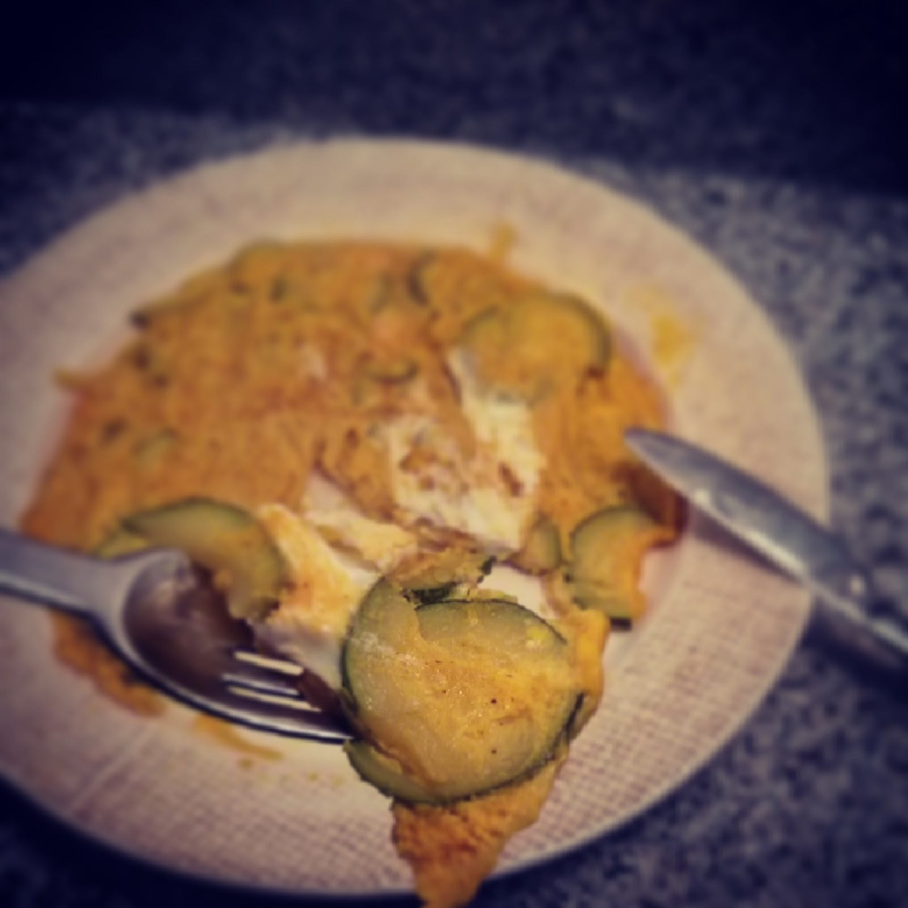

  

**usei:**

\- 3 ovos

\- 1 cebola

\- 1/2 courgette

\- curcuma em pó

\- azeite

\- sal, pimenta

  
**como fiz:**  

1. saltear a cebola e a courgette com azeite
2. adicionar curcuma e temperar com sal e pimenta
3. bater os ovos numa taça e juntar a courgette e a cebola
4. colocar o preparado na frigideira onde se salteou a cebola e a courgette
5. deixar cozinhar, virando a meio a tortilha a meio da cozedura
