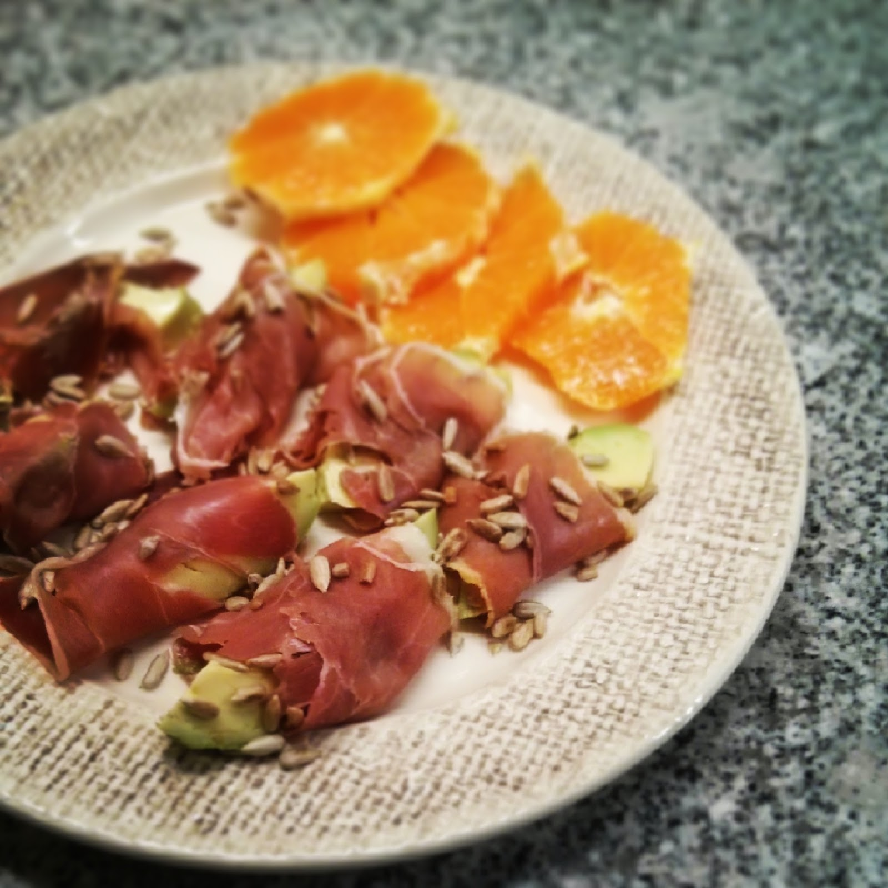

  

**usei:**

\- 3 fatias de presunto

\- 1 pêra abacate

\- 1 laranja

\- 1 mão cheia de sementes de girassol

  
**como fiz:**  

1. tostar as sementes numa frigideira anti-aderente
2. cortar as fatias de presunto ao meio
3. cortar a pêra abacate às fatias
4. enrolar as fatias de abacate com o presunto, colocando algumas sementes no interior
5. salpicar com as sementes que sobrem
6. servir com a laranja às rodelas

  

Breve vídeo disponível em [http://instagram.com/p/mg-fgOIXZz](http://instagram.com/p/mg-fgOIXZz).
