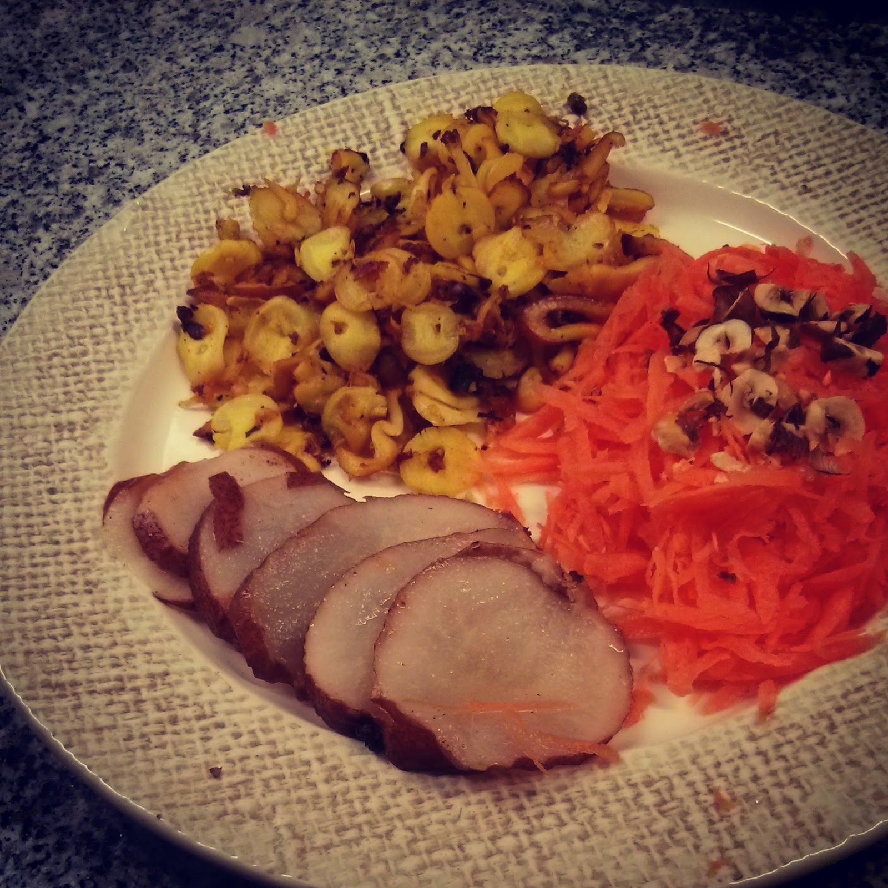

  

Hoje o pequeno-almoço foi literalmente feito à custa de sobras. Ontem o jantar foi polvo à lagareiro e aproveitámos o forno para fazer pêras assadas. Como sobrou de ambos, resolvi usar para pequeno-almoço.

  

**usei:**

\- dois tentáculos e uma cabeça de polvo assado no forno

\- duas pêras assadas no forno

\- uma cenoura 

\- óleo de coco, q.b.

\- pimenta e curcuma, q.b.

\- duas ou três avelãs tostadas

  

**como fiz:**

1. cortar o polvo em fatias muito pinas
2. saltear o polvo no oleo de coco, temperando com pimenta e curcuma
3. servir o polvo com cenoura ralada, avelãs picadas e as pêras fatiadas
