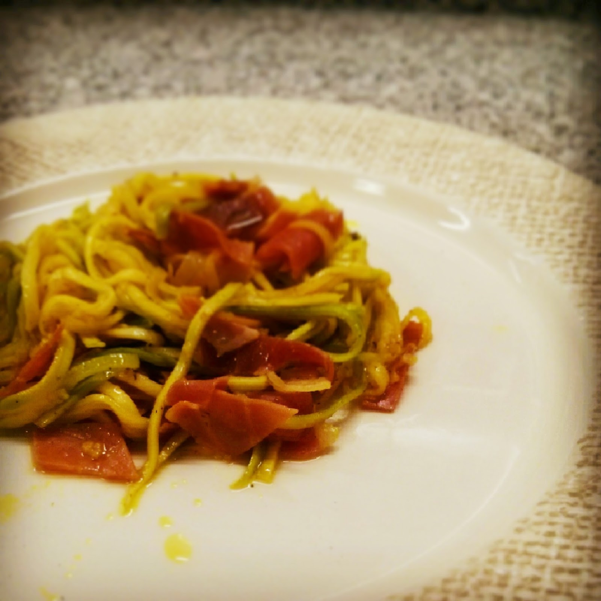
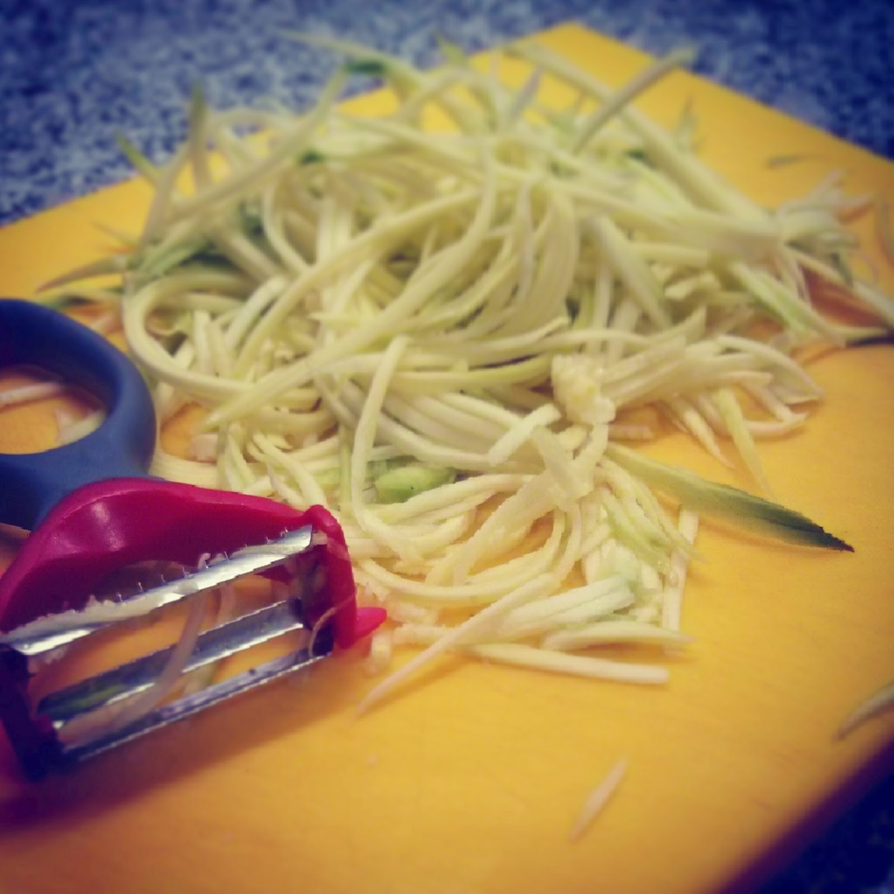

  

Já andava há algum tempo para comprar um descascador de vegetais que me permitisse fazer noodles de courgette. Esta semana encontrei uma promoção e "avancei". Experimentei hoje ao pequeno-almoço e foi uma agradável surpresa. A textura é muito boa. 

  

**usei:**

\- 1 courgette pequena

\- 1 colher de chá óleo de coco

\- sal e pimenta

\- curcuma

\- 2 fatias de presunto

  

**como fiz:**

1. descascar a courgette e fizer os noodles usando o descascador (que basicamente tem duas lâminas, uma que descasca normalmente e outra que faz "fios", como se pode ver na foto em baixo)
2. saltear os noodles em óleo de coco, temperando com sal, pimenta e curcuma em pó, não deixando cozer em demasiado (tem que ficar "al dente")
3. cortar o presunto aos quadrados e juntar

  

  

