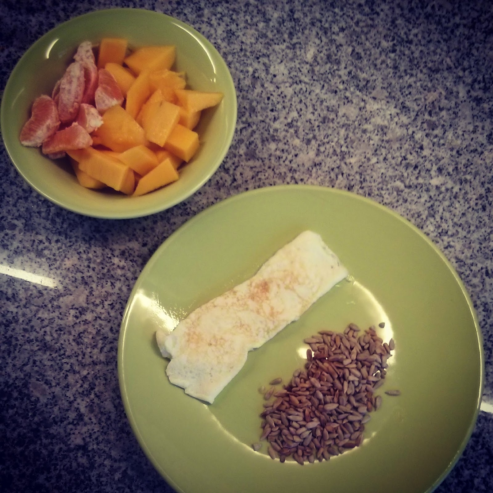

  

As omeletes normais não "caem" bem à Vânia. Ontem fiz-lhe uma omelete só de claras, com sementes de girassol tostadas e fruta (laranja e manga). 

  

Para aproveitar as gemas, fiz uma omelete para mim, usando um ovo extra e as sobras de courgette dos [zoodles](http://blog.cozinhadecaverna.com/2014/04/dia-1072-noodles-de-courgette-zoodles.html).
