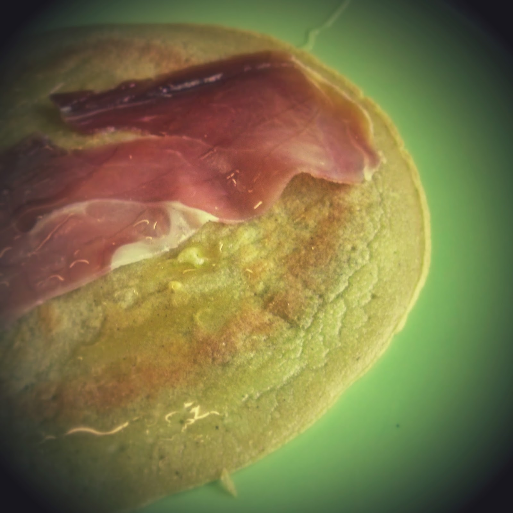
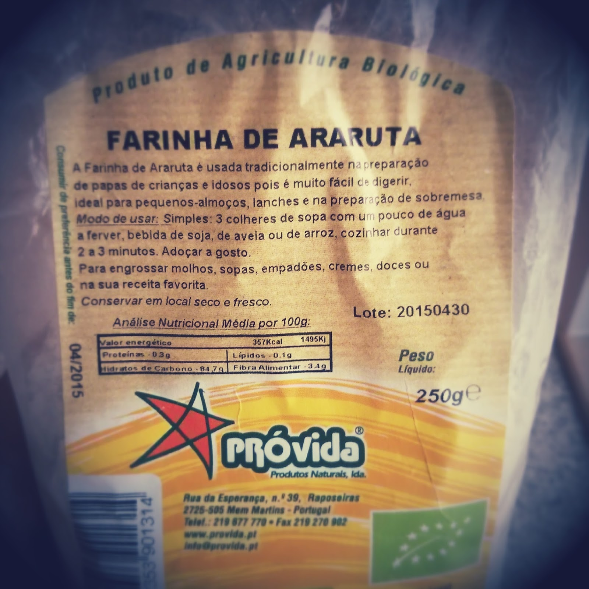

  

Domingo, dia do pequeno-almoço mais familiar e com tempo da semana. Apeteceu-me experimentar alguma receita nova. Tinha farinha de coco e de araruta na despensa. Após uma breve pesquisa no Google encontrei uma receita perfeita: [Simple Paleo Tortillas](http://stupideasypaleo.com/2013/08/23/simple-paleo-tortillas/) do _blog_ Stupid Easy Paleo. Fiz apenas ligeiras alterações tendo em conta os ingredientes que tinha em casa. 

  

Esta receita que uma vantagem adicional para quem não gosta de comer ovos _per si_, visto que são necessários dois para fazer três crepes, em geral mais do que suficientes para uma pessoa.

  

Dupliquei os ingredientes para fazer dois crepes para cada um de nós (seis crepes no total). Eu e a Inês comemos com presunto e um ligeiro fio de mel. A Vânia preferiu canela e mel.

  

As senhoras cá de casa adoraram. Os crepes têm uma boa textura e não se desfazem. Devem ser bons para rechear com vegetais ou carne picada.

  

**usei:**

\- 1/2 chávena de farinha de araruta (foto em baixo - esta farinha não é tão comum como a de coco)

\- 2 colheres de chá de farinha de coco

\- 4 ovos

\- 2 colheres de sopa de óleo de coco derretido

\- 2 colheres de sopa de água (ou 30 gramas)

\- sal q.b.

\- canela q.b.

  

**como fiz:**

1. bater os ovos
2. juntar a água e o óleo de coco derretido e voltar a bater
3. juntar as farinhas com a canela e o sal
4. juntar aos líquidos e bater tudo bem
5. aquecer uma frigideira anti-aderente
6. colocar 1/6 da massa na frigideira girando para que o liquido cubra o fundo
7. deixar cozinhar 1 minuto de cada lado

  
  

