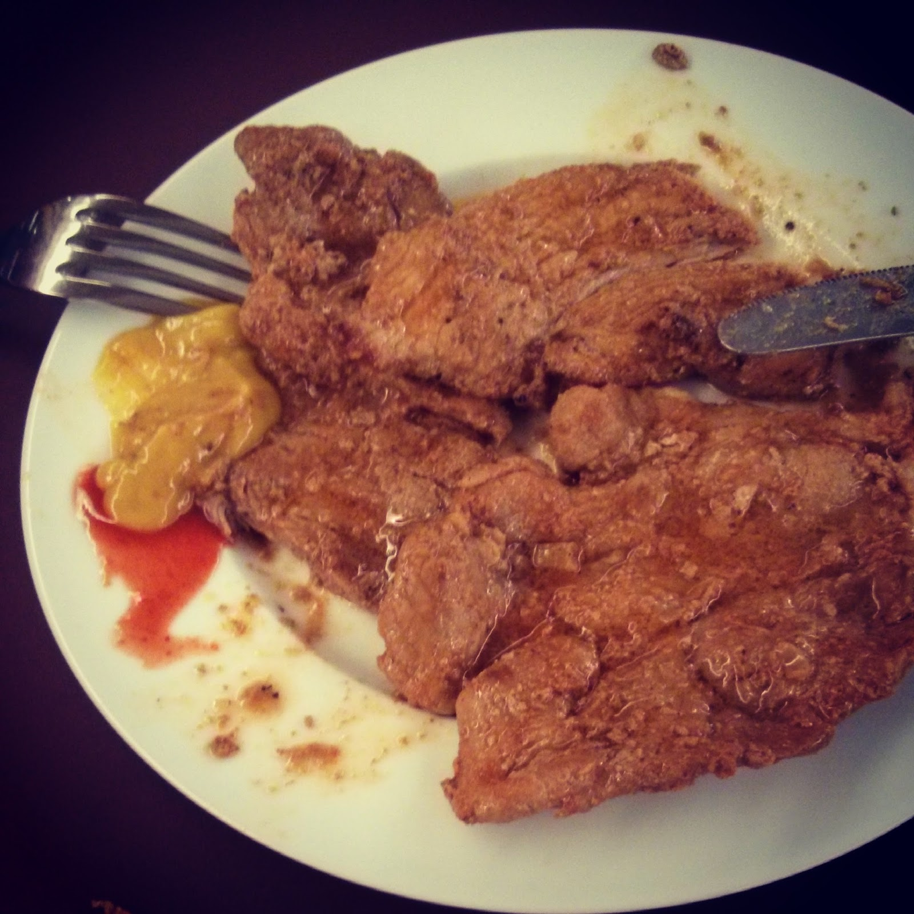
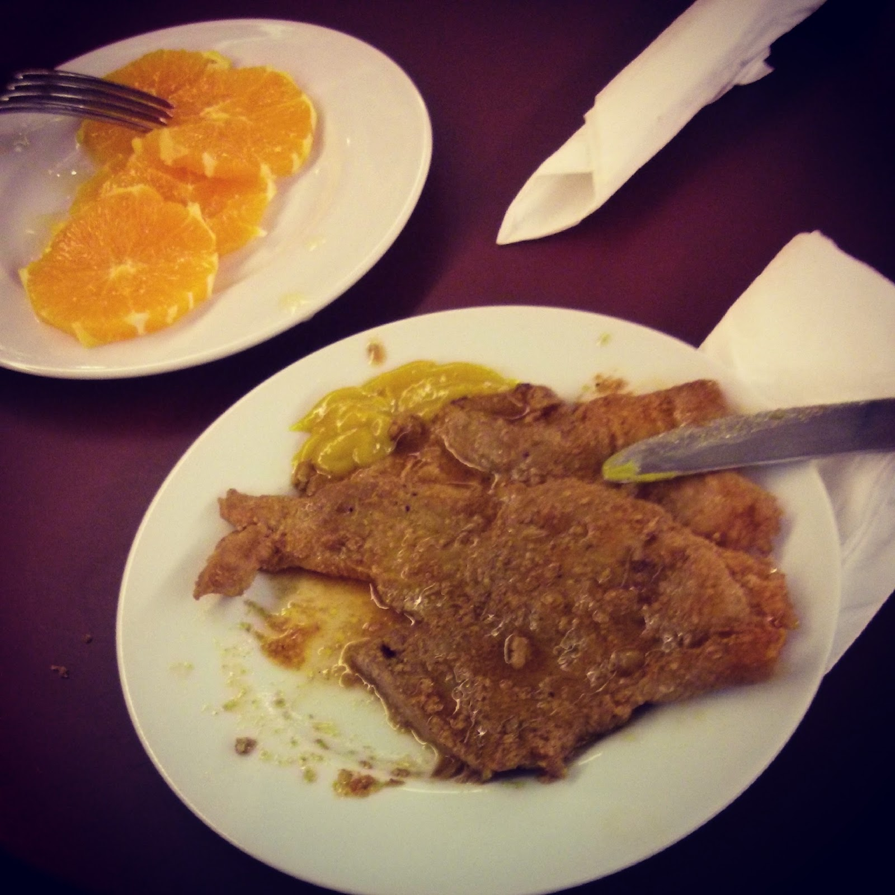

Hoje não comi grande pequeno-almoço. Estava com muita pressa, fiz ovos mexidos para a Inês, comi metade dos mesmos directamente da frigideira e de pé, depois de a servir, seguidos de uma laranja. Nem tempo tive para tirar fotos.  
  
Aproveito para deixar uma história que é ao mesmo tempo uma sugestão.  
  
Hoje foi dia de Benfica-Porto para a taça de Portugal. A uma hora do inicio jogo estive na estação do metro do Alto dos Moinhos, bastante perto do estádio da luz. Junto às instalações do metro, por debaixo do viaduto da avenida dos lusíadas, existe um café-pastelaria que serve bifanas em dias de jogo.  
  
\- "Boa tarde. Quero duas bifanas sem pão por favor.", peço eu.  
\- "SEM PÃO?!?!? Não temos.", responde uma senhora que está atrás do balcão, a fazer uma cara estranha.  
\- "Não têm?!?", penso eu.  
\- "Temos sim. Serve num prato cortada aos pedaços", riposta um colega antes que eu pudesse responder alguma coisa - melhor assim.  
\- "Não necessita de cortar, eu trato disso. Dê-me só um garfo e faca por favor.".  
\- "Sai duas bifanas no prato.", grita para a cozinha.  
\- "Que cheiro fantástico que vem da cozinha.", pensei eu.  
\- "Aqui tem as bifanas, um garfo e faca.".  
Adicionei ao prato um pouco de mostarda e picante. Estavam maravilhosas.  
  

  

Terminei as bifanas e pensei: "Apetece-me mais uma...".

  

\- "Mais uma bifana no prato p.f."

\- "Já agora, aquelas laranjas que estão ali... pode vender-me uma?"

\- "Ó amigo... aquelas laranjas são para fazer sumo."

\- "Ok, mas não me pode vender uma?"

\- "O amigo tem cada uma... mas pode ser."

\- "Dá também uma laranja ao senhor.", pede a uma colega

....

\- "Aqui tem".

  

  

Esta ainda me soube melhor! Altamente recomendado em dias em que o Benfica joga em casa!!!!
