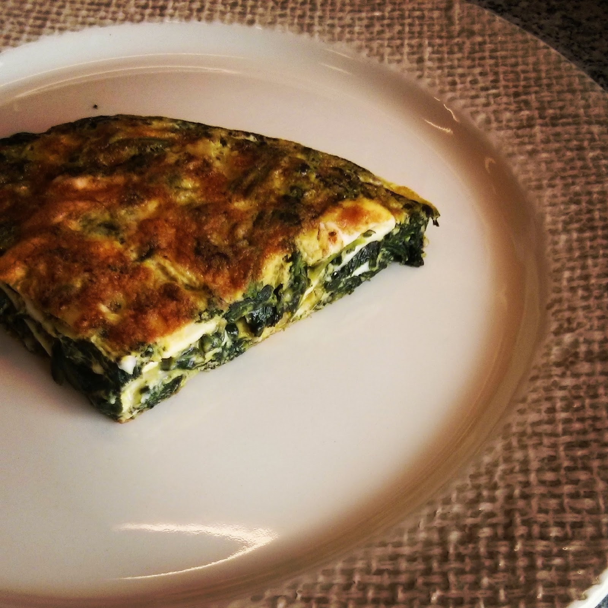

  

Ontem foi dia em que saí um bocado da linha. Hoje acordei e não me apeteceu comer. Interrompemos o jejum com uma tortilha de espinafres.

  

**usei:**

\- 1 molho de espinafres

\- 4 ovos

\- 1 cebola pequena

\- 2 dentes de alho

\- azeite

\- sal, pimenta

\- 3 fatias de queijo (opcional)

  
**como fiz:**  
  

1. lavar os espinafres e cozinhar os espinafres numa frigideira grande
2. retirar os espinafres e retirar o excesso de água com a ajuda de um escorredor
3. na mesma frigideira, refogar a cebola e os alhos com um pouco de azeite
4. adicionar os espinafres escorridos e saltear um pouco
5. bater os ovos e juntar os espinafres (opcionalmente adicionar as fatias de queijo cortadas em pedaços)
6. colocar na frigideira e cozinhar de ambos os lados (virar com a ajuda de um prato)
