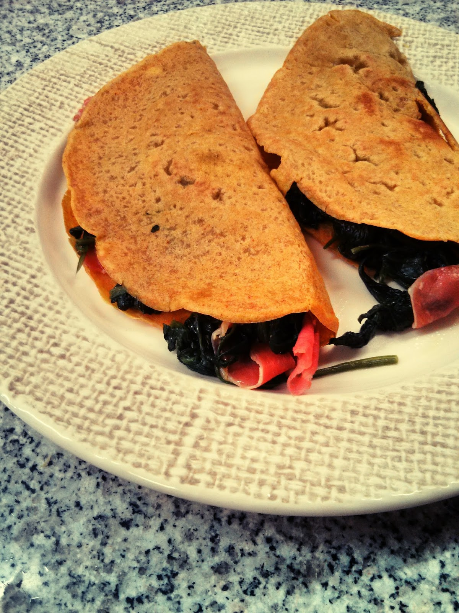

  

**usei:** 

\- preparado de [crepes de araruta e coco](https://renatoalvestorres.net/2014/04/13/dia-1074-crepes-de-farinha-de-araruta-e-coco/), com uma pitada de curcuma

\- 1 molho de espinafres

\- 2 fatias de presunto

\- azeite

\- sal e pimenta

  

**como fiz:**

1. cozinhar os espinafres numa frigideira
2. retirar os espinafres da frigideira (e remover o excesso de água caso se aplique)
3. aquecer um pouco de azeite na frigideira e saltear os espinafres escorridos, temperando com sal e pimenta
4. reservar os espinafres
5. cozinhar os crepes na mesma frigideira
6. encher os crepes com os espinafres e as fatias de presunto cortadas em pedaços

  

Fiz um breve video ilustrativo que pode ser visto aqui: [http://instagram.com/p/nHvq6woXYR/](http://instagram.com/p/nHvq6woXYR/)
