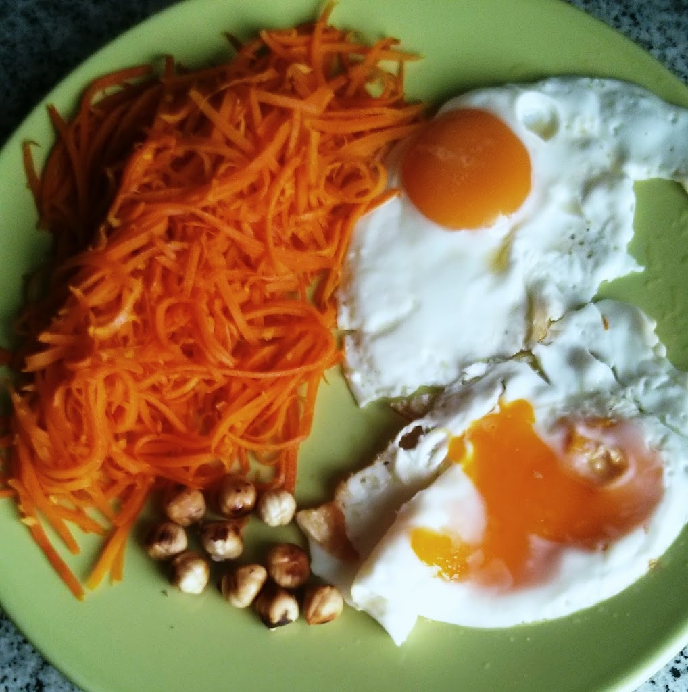

  

Adoro a combinação de cenoura com gengibre e hoje resolvi juntar estes dois ingredientes ao pequeno-almoço.

  

**usei:**

\- 2 cenouras

\- 2 ovos

\- 1 cubo de raiz de gengibre fresca

\- óleo de coco

\- avelãs

  

**como fiz:**

1. tostar as avelãs numa frigideira anti-aderente e reservar (mexer com frequência para não queimar as avelãs)
2. enquanto as avelãs tostam, cortar as cenouras em esparguete (ver utensílio [aqui](http://2.bp.blogspot.com/-T8a50knSzeU/U0evzIKA60I/AAAAAAAAN2I/RSsJD5zxUf8/s1600/IMG_20140411_092341~2.jpg))
3. picar o gengibre
4. colocar óleo de coco na frigideira e saltear um pouco o gengibre
5. adicionar a cenoura e deixar cozinhar, mexendo com frequência
6. reservar a cenoura
7. colocar óleo de coco na frigideira e estrelar os dois ovos
8. servir a cenoura com os ovos e algumas avelãs tostadas
