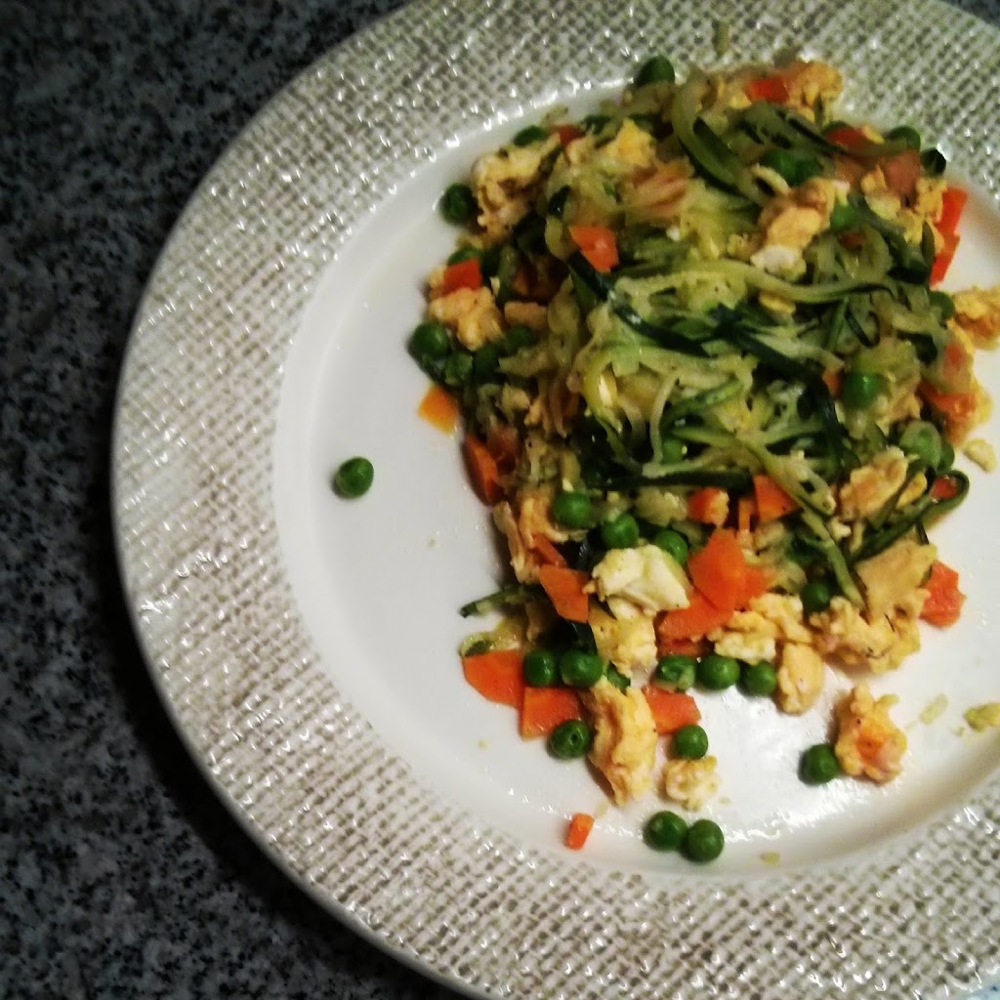

  
**usei:**  
\- 1 courgette  
\- 2 ovos  
\- 1 cenoura  
\- 1 punhado de ervihas  
\- oleo de coco  
\- sal, pimenta  
  
**como fiz:**  
  

1. cortar a corgette em esparguete
2. cortar a cenoura em cubos pequenos
3. aquecer oleo de coco e saltear as ervilhas e a cenoura
4. adicionar o esparguete de courgete e deixar cozinhar
5. rectificar temperos
6. reservar os vegetais
7. mexer os dois ovos
8. adicioar os vegetais e envolver tudo
