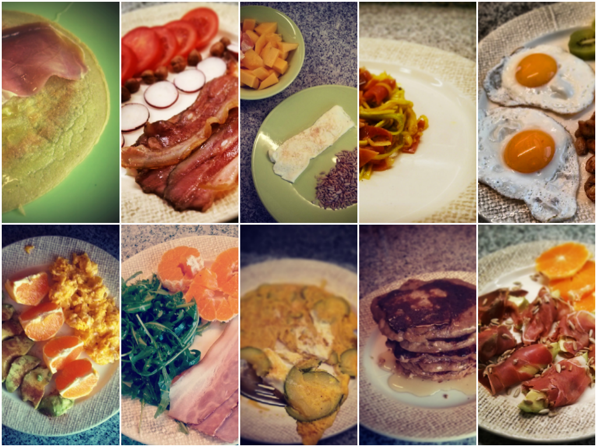

  

Comecei esta série após uma conversa com a Susana, que queria algumas ideias sobre "paleo", sendo o pequeno-almoço a sua principal dificuldade. Eu andava sem tempo para o _blog_ e aproveitei esta motivação para escrever, ajudar uma pessoa e para me obrigar a sair da rotina alimentar matinal. 

  

Foi um bom desafio visto que a maior parte das receitas foram preparadas de manhã sob o _stress_ normal da rotina diária que inclui vestir, alimentar e lavar a Inês, sem que chegue atrasado ao trabalho ou ao infantário.  

  

Os ingredientes que usei são relativamente simples e fáceis de encontrar (tirando talvez as farinhas e o óleo de coco que compro no [celeiro](http://www.celeiro-dieta.pt/) ou na [miosótis](http://www.biomiosotis.com/)):

- **Proteínas**: ovos, bacon, presunto, chouriço, carne vaca picada, cavala em lata, tamboril aos cubos
- **Vegetais e tubérculos**: batata doce, courgette, pêra abacate, tomate, rabanetes, espinafres, cebolas, coentros, cenouras, rúcula, salada de alfaces e rúcula (pacote), ervilhas
- **Fruta**: banana, kiwi, pêra, maçã, laranja
- **Farinhas**: araruta, coco
- **Sementes e frutos secos**: sementes de girassol, avelãs, amêndoas, caju
- **Gorduras**: [banha de porco preto](https://renatoalvestorres.net/2013/02/02/dia-640-banha-da-meia-noite-midnight-lard/), óleo de coco, azeite, manteiga de vaca
- **Temperos e especiarias**: sal, curcuma, pimenta preta, raiz de gengibre, canela

Deixo a lista de receitas que não está [ordenada cronologicamente](https://renatoalvestorres.net/search/label/susana) como no _blog_ mas sim por grupos que me pareceram mais adequados. 

  

**Ovos Básicos (Estrelados ou Mexidos)**

- ovos estrelados, cogumelos salteados  e kiwi ([ver](https://renatoalvestorres.net/2014/03/24/dia-1054-cogumelos-salteados-com-ovos-estrelados-e-kiwi/))
- ovos estrelados, tomate, rabanetes e morangos ([ver](https://renatoalvestorres.net/2014/03/31/dia-1061-ovos-estrelados-tomate-rabanetes-e-morangos/))
- ovos estrelados, laranja e amêndoas ([ver](https://renatoalvestorres.net/2014/04/06/dia-1067-ovos-estrelados-laranja-e-amendoas/))
- ovos estrelados, cenoura ralada e pêra ([ver](https://renatoalvestorres.net/2014/04/14/dia-1075-ovos-estrelados-cenoura-ralada-e-pera/))
- ovos mexidos, abacate picante e kiwi ([ver](https://renatoalvestorres.net/2014/04/02/dia-1063-ovos-mexidos-abacate-picante-e-kiwi/))
- ovos mexidos, laranja e pêra abacate com mel e canela ([ver](https://renatoalvestorres.net/2014/04/07/dia-1068-ovos-mexidos-laranja-e-pera-abacate-com-mel-e-canela/))
- ovos mexidos, laranja e avelãs tostadas ([ver](https://renatoalvestorres.net/2014/04/10/dia-1071-a-despachar-ovos-mexidos-laranja-e-avelas-tostadas/))
- ovos mexidos, maçã, salada de alface, rúcula e red pak choi ([ver](https://renatoalvestorres.net/2014/04/27/dia-1088-ovos-mexidos-maca-salada-de-alface-rucula-e-red-pak-choi/))

  

****Tortilhas e Omeletes****

- tortilha de courgette, alho francês e coentros ([ver](https://renatoalvestorres.net/2014/03/28/dia-1058-tortilha-de-courgette-alho-frances-e-coentros/))
- tortilha de cebola, courgette e curcuma ([ver](https://renatoalvestorres.net/2014/04/03/dia-1065-tortilha-de-cebola-courgette-e-curcuma/))
- tortilha de espinafres ([ver](https://renatoalvestorres.net/2014/04/18/dia-1079-tortilha-de-espinafres/))
- omelete de claras, sementes tostadas e fruta ([ver](https://renatoalvestorres.net/2014/04/12/dia-1073-omelete-de-claras-sementes-tostadas-e-fruta/))

  

**Crepes e Panquecas**

- panquecas nom nom paleo ([ver](https://renatoalvestorres.net/2014/03/29/dia-1059-panquecas-nomnompaleo/))
- crepes de araruta e coco com presunto e mel ([ver](https://renatoalvestorres.net/2014/04/13/dia-1074-crepes-de-farinha-de-araruta-e-coco/))
- crepes de araruta e coco com espinafres e presunto ([ver](https://renatoalvestorres.net/2014/04/23/dia-1084-crepes-de-araruta-com-espinafres-e-presunto/))

  

**Esparguete de Vegetais e Zoodles**

- zoodles com presunto e curcuma ([ver](https://renatoalvestorres.net/2014/04/11/dia-1072-noodles-de-courgette-zoodles-com-presunto-e-curcuma/))
- zoodles xau xau ([ver](https://renatoalvestorres.net/2014/04/30/dia-1091-zoodles-xau-xau/))
- esparguete de cenoura com gengibre, ovos estrelados e avelãs tostadas ([ver](https://renatoalvestorres.net/2014/04/26/dia-1087-esparguete-de-cenoura-com-gengibre-ovos-estrelados-e-avelas-tostadas/))

  

**Presunto, Bacon, Chouriço e Carne Picada**

- abacate envolvido em presunto com sementes tostadas e laranja ([ver](https://renatoalvestorres.net/2014/04/08/dia-1069-abacate-envolvido-em-presunto-com-sementes-tostadas-e-laranja/))
- presunto, banana, cenoura ralada e sementes tostadas ([ver](https://renatoalvestorres.net/2014/03/30/dia-1060-presunto-com-banana-cenoura-ralada-e-sementes-tostadas/))
- presunto, batata doce salteada em óleo de coco e kiwi ([ver](https://renatoalvestorres.net/2014/04/05/dia-1066-presunto-batata-doce-salteada-em-oleo-de-coco-e-kiwi/))
- presunto, amêndoas, banana e salada ([ver](http://1.bp.blogspot.com/-4wIdumyrnrI/U2GOaLu3ZpI/AAAAAAAAOjQ/3oBh9bBChFc/s1600/IMG_20140429_074321.jpg))
- bacon, ovo estrelado, banana, rúcula com caju, azeite e vinagre balsâmico ([ver](https://renatoalvestorres.net/2014/04/17/dia-1078-bacon-ovo-estrelado-banana-rucula-com-caju-azeite-e-vinagre-balsamico/))
- bacon, tomate, avelãs e rabanetes ([ver](https://renatoalvestorres.net/2014/04/01/dia-1062-bacon-tomate-avelas-e-rabanetes/))
- bacon, salada de rúcula e laranja ([ver](https://renatoalvestorres.net/2014/04/15/dia-1076-salada-de-rucula-bacon-e-laranja/))
- chouriço, cenoura salteada com canela e sementes tostadas ([ver](https://renatoalvestorres.net/2014/03/27/dia-1057-cenoura-salteada-com-canela-sementes-tostadas-e-chourico/))
- carne picada com espinafres e ovo ([ver](https://renatoalvestorres.net/2014/03/26/dia-1056-carne-picada-com-espinafres-e-ovo/))

**Peixe**

- salada de cavala ([ver](https://renatoalvestorres.net/2014/03/25/dia-1055-salada-de-cavala/))
- cavala em azeite picante, laranja, abacate, sementes tostadas e sumo de mirtilos ([ver](https://renatoalvestorres.net/2014/04/03/dia-1064-cavala-em-azeite-picante-laranja-abacate-sementes-tostadas-e-sumo-de-mirtilos/))
- cubos de tamboril e presunto salteados em banha de porco preto com curcuma e pimenta, acompanhados de salada ([ver](https://renatoalvestorres.net/2014/04/28/dia-1089-cubos-de-tamboril-e-presunto-salteados-em-banha-de-porco-preto-com-curcuma-e-pimenta-acompanhados-de-salada/))
- polvo assado no forno, salteado com gengibre, óleo de coco e curcuma, cenoura ralada e fatias de peras assadas no forno ([ver](https://renatoalvestorres.net/2014/04/09/dia-1070-polvo-assado-no-forno-salteado-com-gengibre-oleo-de-coco-e-curcuma-cenoura-ralada-e-fatias-de-peras-assadas-no-forno/))
