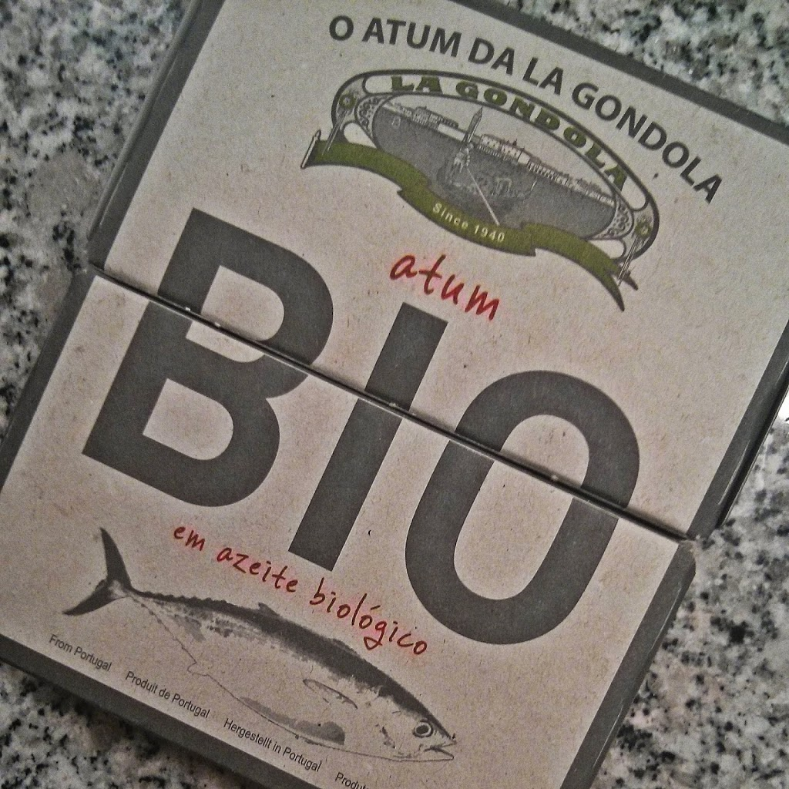
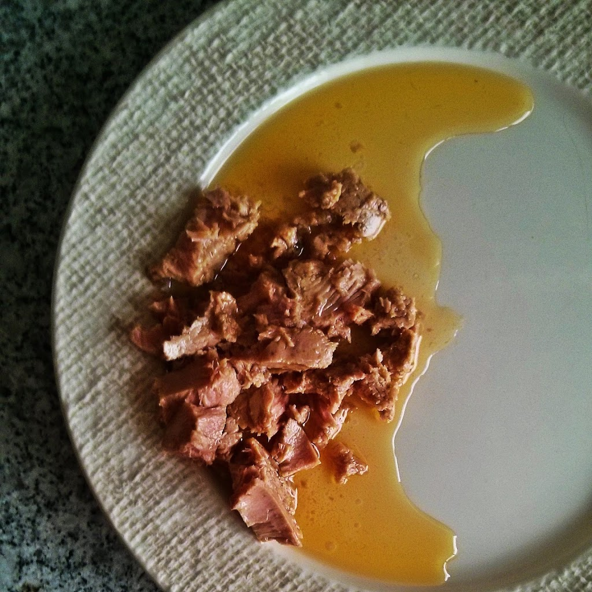
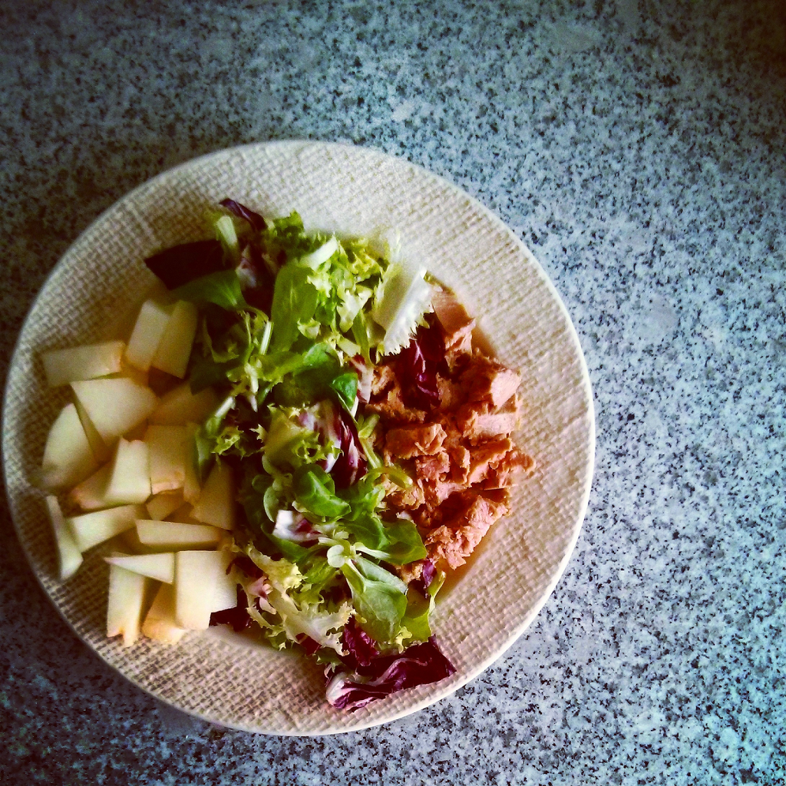

O tempo para os meus lados não abunda mas, verdade seja dita, não tenho andado muito focado no _blog_. O CrossFit e o [Instagram](http://instagram.com/cozinhadecaverna) têm recebido muito mais atenção.  
  
Tendo sido obrigado por um infortúnio de terceiros a estar acordado a esta hora, resolvi aproveitar para fazer um _post_ sobre um atum que provei esta semana: O Atum de La Gondola.  
  
É atum "normal" (ou comum), ou seja, não é posta ou sangacho. O azeite é biológico, bem mais escuro do que aquele que se encontra fácilmente num supermercado, ainda que uns pontos a baixo do meu favorito (o [Atum em Azeite a Sério](https://www.facebook.com/pages/Atum-em-Azeite-a-S%C3%A9rio/164676220297239), sobre o qual hei-de falar um dia).  
  
Comprei no [Amor Bio](http://www.amorbio.pt/) e já não me lembro exactamente quanto custou, mas anda por volta dos 2 EUR.  
  
A embalagem tem um detalhe interessante de _design_, que permite que as embalagens na prateleira componham uma imagem maior.  
  
Deixo em baixo fotos da embalagem, do conteúdo e do pequeno-almoço que fiz com este atum.  
  

  

  

  

